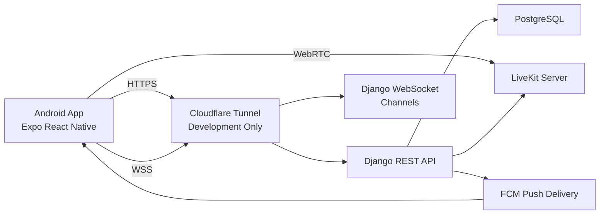
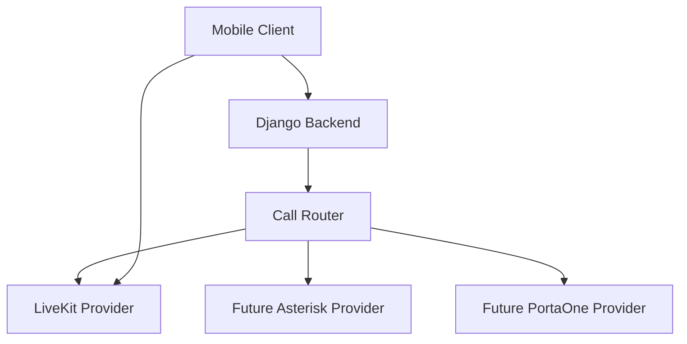
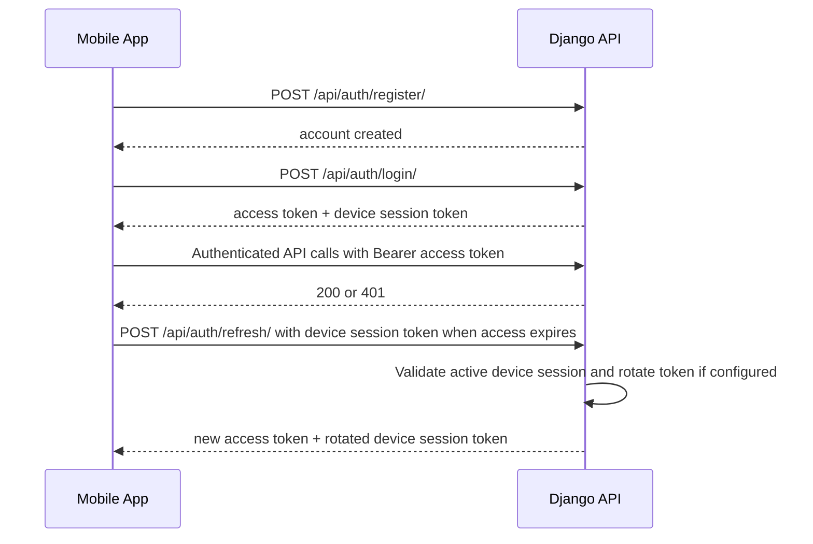
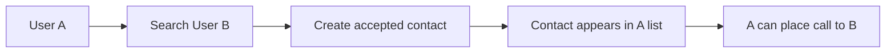
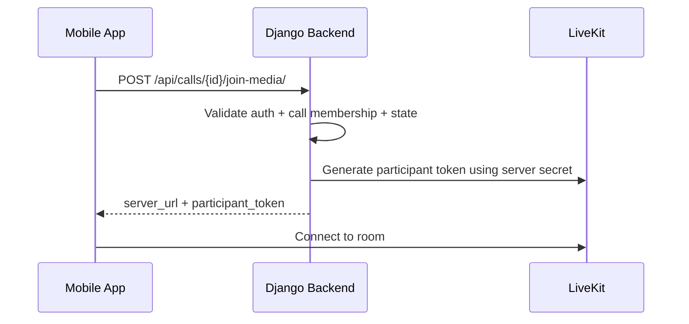
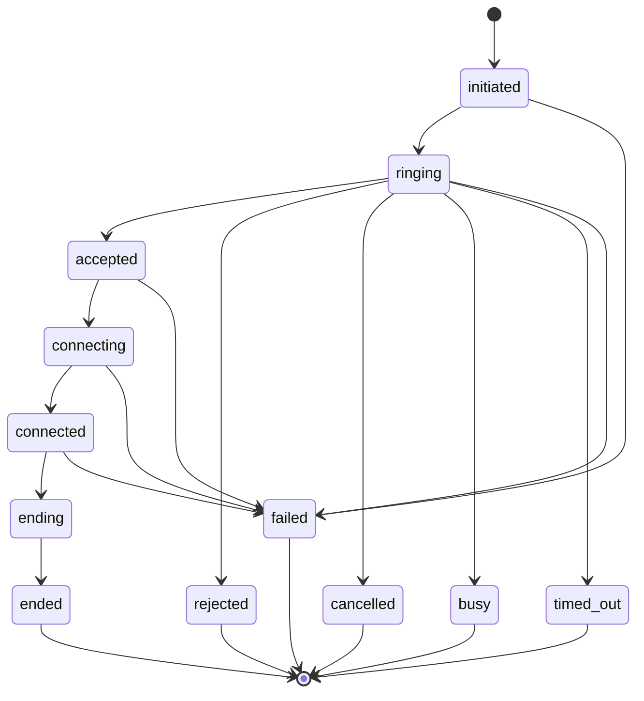
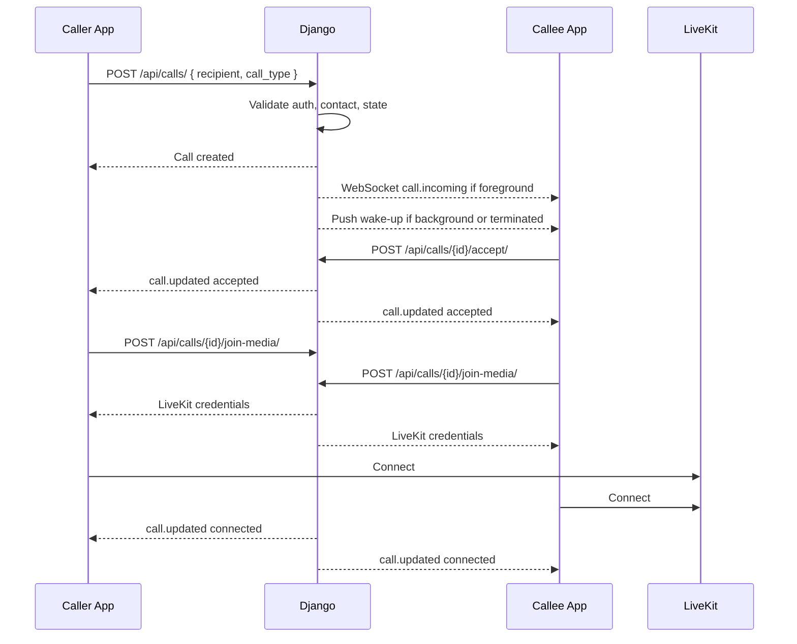
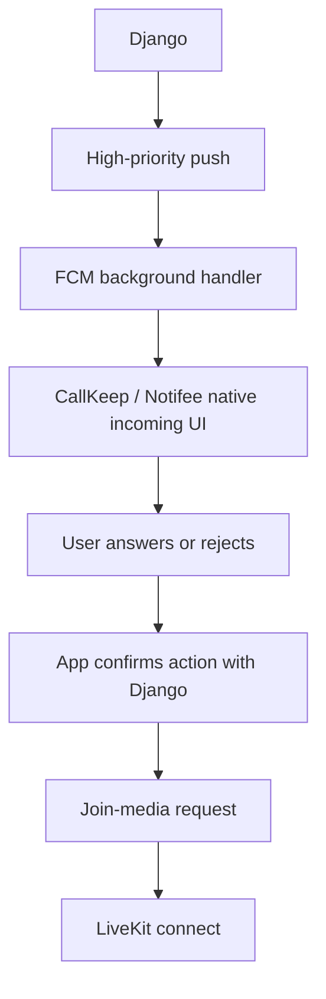

# Android Softphone MVP Implementation Plan

Status: Planning only. Do not implement from this document until it has been reviewed and approved.

Primary target: Android first

Scope of this plan:

- Build a greenfield Android-first mobile softphone app.
- Use Expo + React Native + TypeScript on mobile.
- Use Django + DRF + Channels + PostgreSQL on backend.
- Support app-to-app audio and video calling through LiveKit.
- Support registration, login, profile, user discovery, contacts, secure auth, realtime signaling, and LiveKit media.

Out of scope for this MVP:

- PSTN
- SIP trunking
- Asterisk implementation
- PortaOne or PortaSIP implementation
- WhatsApp, Telegram, or other external telephony integrations
- Multi-party calling
- OTP or SMS verification

Important future requirement:
The backend must be designed so future app-to-external telephony providers can be added without rewriting the mobile client.

## 1. Project Assessment

### Current repository state

- The repository is effectively blank.
- Present files at planning time:
  - `GitHub Copilot - Comprehensive Android Softphone Project Planning Prompt.md`
- No mobile project exists yet.
- No backend project exists yet.
- No package manager lockfiles, build files, Django config, Expo config, or environment files exist yet.

### Host environment facts verified during planning

- OS: Ubuntu 24.04.4 LTS
- Node.js: `v24.20.0`
- npm: `11.19.0`
- Java currently active on PATH: OpenJDK `21.0.12`
- Java path: `/usr/bin/java`
- System Python currently active on PATH: `3.12.3`
- `uv` installed: `0.11.28`
- uv-managed CPython versions already installed:
  - `cpython-3.13.7`
  - `cpython-3.12.3`
  - `cpython-3.10.18`
- JDKs present under `/usr/lib/jvm`:
  - Java 17
  - Java 21
- Android SDK present under `$HOME/Android/Sdk`
- Installed Android SDK platforms:
  - `android-35`
  - `android-36`
- Installed build tools:
  - `34.0.0`
  - `36.1.0`

### Not directly verified from tools

- `adb` availability on PATH
- Android Studio installation status
- PostgreSQL installation status

### Requested target versions not yet verified as installed locally

- OpenJDK 25 is available from Ubuntu packages, but it is not installed yet.
- uv-managed CPython 3.14 is not installed yet.
- Django 6.0 is a valid target, but the backend project has not been initialized yet.

### Consequence

The implementation must begin with environment verification and a focused compatibility spike before heavy scaffolding, because the requested backend target stack is newer than some earlier package support matrices.

## 2. Architecture Overview

### Core architecture decisions

- Django is the control plane.
- LiveKit is the media plane.
- WebSocket is the realtime signaling and state-delivery path.
- REST is the primary mutation and data-fetching path.
- During development, Cloudflare Tunnel exposes Django over a temporary but stable public HTTPS and WSS hostname so the app can be tested on arbitrary devices outside the local network.
- In production, Django is hosted on a VPS behind a dedicated DNS hostname rather than behind the development Cloudflare Tunnel.
- Mobile never receives LiveKit API secret.
- Mobile is provider-agnostic at the API level.
- Backend chooses and authorizes the media provider.

### High-level system diagram



### Future extensibility diagram



### Why this architecture

- It keeps business authorization and media transport separate.
- It avoids shipping provider secrets to the mobile client.
- It preserves a clean path for future external telephony providers.
- It reduces coupling between mobile UI and backend telephony decisions.

## 3. Technology and Version Decisions

### Mobile stack

- Expo
- React Native
- TypeScript
- Expo Router
- gluestack UI v5
- NativeWind v5
- TanStack Query
- Zustand
- LiveKit React Native SDK
- `lucide-react-native` for icons
- `expo-font` and `@expo-google-fonts/roboto-flex` for typography

### Backend stack

- Python `3.14.x` managed by `uv` as CPython
- Django `6.0.x` stable series
- Django REST Framework `3.18.x` stable series
- djangorestframework-simplejwt
- Django Channels
- Uvicorn
- PostgreSQL 16
- psycopg 3

### Native Android integration stack

- Expo development build workflow
- `@livekit/react-native`
- `@livekit/react-native-webrtc`
- `livekit-client`
- `expo-notifications`
- `expo-task-manager`
- `@react-native-firebase/app`
- `@react-native-firebase/messaging`
- `react-native-callkeep`
- `@notifee/react-native`

### Version policy

- Use the current Expo default project baseline generated by `create-expo-app`.
- Use Node.js LTS. Node `24.20.0` is already installed and fits the plan.
- Use uv-managed CPython `3.14.x` for the backend and pin it per project.
- Use Django `6.0.x` and DRF `3.18.x` for the backend baseline.
- Treat JDK `25` as the requested Java target, but keep JDK `17` available as the Android build fallback until the generated Expo Android project proves Java 25 compatibility.
- Do not install Kotlin separately.
- Let the generated Expo Android project define Gradle and Kotlin plugin versions.

### Compatibility summary

- Node `24.20.0` is compatible with the plan because current Expo guidance requires Node LTS rather than a narrow hard-pinned major.
- Python `3.14.x` is stable and Django `6.0` explicitly supports Python `3.12`, `3.13`, and `3.14`.
- DRF `3.17.0+` added support for Python `3.14`, and DRF `3.18.x` is the latest stable line at planning time.
- SimpleJWT is the main lagging dependency. Its published getting-started matrix still documents support only through Python `3.13`, Django `5.1`, and DRF `3.15`. The plan keeps it, but makes an early compatibility spike mandatory.
- Gradle supports Java `25` only from `9.1.0` onward. Expo documentation still teaches JDK `17` for Android local development, so the Android build plan must preserve a JDK 17 fallback even if Java 25 is installed system-wide.

### Why not install Kotlin manually

- Android Gradle plugin manages the Kotlin compiler used by the project.
- Expo-generated Android builds will already include a compatible Kotlin plugin.
- A global Kotlin install is unnecessary and can create version drift.

## 4. Development Environment Setup

### 4.1 Required toolchain targets

- Node.js: LTS, with `24.20.0` already verified locally
- npm: version bundled with Node.js LTS, with `11.19.0` already verified locally
- Java: JDK 25 as requested target, with JDK 17 retained as Android build fallback
- Android SDK Platform: 36
- Android Build Tools: a modern version compatible with platform 36
- Android Emulator: optional for early UI and build validation
- Physical Android devices: required for full incoming call verification
- Python: uv-managed CPython `3.14.x`
- PostgreSQL: 16
- `uv`: latest stable

### 4.2 Verification commands

Run these before scaffolding:

```bash
node -v
npm -v
java -version
echo "$JAVA_HOME"
echo "$ANDROID_HOME"
adb --version
python3 --version
uv --version
uv python list --only-installed
psql --version
```

Install and maintain Python for this project through `uv` as a managed CPython runtime.

### 4.3 Ubuntu installation commands

#### Node.js LTS via nvm

```bash
curl -o- https://raw.githubusercontent.com/nvm-sh/nvm/v0.40.3/install.sh | bash
source "$HOME/.nvm/nvm.sh"
nvm install --lts
nvm use --lts
node -v
npm -v
```

#### Java 25

```bash
sudo apt update
sudo apt install -y openjdk-25-jdk
java -version
update-alternatives --list java
```

If the Expo Android build fails under Java 25, switch the mobile build runtime back to Java 17 without uninstalling Java 25.

#### Recommended shell exports

Add to `~/.bashrc`:

```bash
export JAVA_HOME=/usr/lib/jvm/java-25-openjdk-amd64
export ANDROID_HOME=$HOME/Android/Sdk
export PATH=$PATH:$ANDROID_HOME/platform-tools
export PATH=$PATH:$ANDROID_HOME/emulator
export PATH=$PATH:$HOME/.local/bin
```

Reload shell:

```bash
source ~/.bashrc
```

#### Android Studio

```bash
sudo snap install android-studio --classic
```

Then confirm in Android Studio SDK Manager:

- Android SDK Platform 36
- Android SDK Build-Tools
- Android Emulator
- Platform-Tools
- one Google Play system image for emulator testing

#### Python, PostgreSQL, and build dependencies

```bash
sudo apt update
sudo apt install -y libpq-dev postgresql postgresql-contrib build-essential
psql --version
```

#### uv-managed CPython 3.14

```bash
uv python install cpython@3.14
uv python pin cpython@3.14
uv python find cpython@3.14
```

When creating the backend environment, use the uv-managed interpreter explicitly:

```bash
cd backend
uv venv --python cpython@3.14
```

#### uv

```bash
curl -LsSf https://astral.sh/uv/install.sh | sh
source "$HOME/.local/bin/env"
uv --version
```

### 4.4 Kotlin, Gradle, and Android compatibility verification

After the Expo app is scaffolded and Android native files exist:

```bash
cd mobile/android
./gradlew -version
```

Use that output to verify:

- Gradle version
- Kotlin plugin version from generated build files
- Java runtime used by Gradle

Decision rule:

- If the first Expo Android build fails under Java 25, switch `JAVA_HOME` to JDK 17 for the mobile build path and continue with Java 25 only as an installed system runtime.

Do not pre-install a standalone Kotlin CLI unless a later custom native workflow explicitly requires it.

## 5. Repository and Project Initialization

### 5.1 Proposed repository layout

```text
livekit-softphone/
  backend/
  mobile/
  docs/
    ANDROID_SOFTPHONE_IMPLEMENTATION_PLAN.md
    IMPLEMENTATION_SO_FAR.md
    REMAINING_IMPLEMENTATION.md
  .gitignore
  README.md
```

### 5.2 Why not use extra monorepo tooling

- The project is still an MVP.
- Backend and mobile can live cleanly in one repository without workspace orchestration overhead.
- Complexity should be introduced only if shared packages become necessary later.

### 5.3 Root `.gitignore` requirements

Include at least:

```gitignore
# Node
node_modules/
npm-debug.log*

# Expo
.expo/

# Python
__pycache__/
*.pyc
.venv/

# Environment
.env
.env.*
!.env.example

# Android/iOS generated by Expo CNG
mobile/android/
mobile/ios/

# Local IDE and OS
.DS_Store
```

### 5.4 Implementation tracking documents

During implementation, maintain these two Markdown files in `docs/`:

- `IMPLEMENTATION_SO_FAR.md`
- `REMAINING_IMPLEMENTATION.md`

Update rule:

- Update `IMPLEMENTATION_SO_FAR.md` at the end of each completed phase with implemented items, commands run, key decisions, deviations, and blockers resolved.
- Update `REMAINING_IMPLEMENTATION.md` after each phase with the remaining work, next actions, active blockers, and any reprioritized phases.
- Keep this implementation plan as the authoritative design and execution document.

## 6. React Native / Expo Initialization

### 6.1 Expo project creation

Create the app under `mobile/`:

```bash
npx create-expo-app@latest mobile
```

Select the default TypeScript project.

### 6.2 Required Expo workflow decision

Use Expo development builds, not Expo Go.

Reason:

- LiveKit React Native SDK uses native modules.
- Firebase Messaging uses native modules.
- CallKeep uses native modules.
- Notifee uses native modules.
- Full-screen Android incoming call UX cannot be delivered through Expo Go.

### 6.3 Development-build bootstrap

```bash
cd mobile
npx expo install expo-dev-client
```

### 6.4 Native generation model

- Use Expo CNG and prebuild.
- Keep `mobile/android/` and `mobile/ios/` generated.
- Prefer config plugins and dynamic app config over manual edits in generated native directories.

### 6.5 First Android compile check

Use a real Android device for the first serious native compatibility test:

```bash
cd mobile
npx expo run:android --device
```

This is the primary development workflow for installing the app over a USB cable on your real Android phone.

### 6.6 Real Android phone install and APK workflow

#### Development build installed over USB

Use this as the default day-to-day workflow:

```bash
adb devices
cd mobile
npx expo run:android --device
```

What this gives you:

- a development build installed directly on the connected Android phone through USB
- native module support for LiveKit, Firebase Messaging, CallKeep, and Notifee
- fast iteration after initial native build

Device setup requirements:

- enable Developer Options on the Android phone
- enable USB debugging
- authorize the machine when Android prompts for USB debugging trust
- verify the device appears in `adb devices`

#### Explicit APK generation for USB installation

When you want a concrete APK artifact during development, generate it from the Android project after prebuild:

```bash
cd mobile
npx expo prebuild --platform android
cd android
./gradlew assembleDebug
```

Expected debug APK path:

```text
mobile/android/app/build/outputs/apk/debug/app-debug.apk
```

Install the APK over USB:

```bash
adb install -r mobile/android/app/build/outputs/apk/debug/app-debug.apk
```

Use cases for the APK workflow:

- validating that a standalone debug APK installs correctly on the phone
- reinstalling quickly without re-running the full Expo device picker flow
- sharing the exact artifact path during debugging

#### Optional preview APK workflow

If later you need a cleaner APK artifact for broader internal testing, add an EAS preview profile that outputs an APK. This is not required for the first implementation phase, because the USB-installed local development build is enough for initial Android development.

Use `npx expo prebuild --clean` only when:

- app config changes
- native dependencies change
- Expo SDK changes

## 7. gluestack UI Setup

### 7.1 Installation approach

Use the gluestack CLI inside `mobile/`.

```bash
cd mobile
npx gluestack-ui@latest init
```

Select:

- NativeWind v5

### 7.2 Expected output from CLI

The CLI should configure:

- Gluestack provider
- Metro config
- Babel config
- `global.css`
- component generator support

### 7.3 Rule

Let the CLI establish the baseline, then refactor into the project structure. Do not hand-roll the initial integration unless the CLI fails.

## 8. NativeWind v5 Setup

### 8.1 Required files and config

- `tailwind.config.js`
- `global.css`
- `babel.config.js`
- `metro.config.js`
- `nativewind-env.d.ts`

### 8.2 Required content paths

Include at minimum:

- Expo Router app files
- `src/**/*.{ts,tsx}`
- shared components and features

### 8.3 Validation step

Before adding business UI, validate one styled screen renders correctly in the development build.

## 9. Kotlin and Native Android Setup

### 9.1 What is actually required now

For the chosen MVP, native Android involvement is necessary for:

- LiveKit WebRTC native layer
- Firebase Messaging background delivery
- full-screen incoming call presentation
- ConnectionService integration
- audio routing and microphone behavior while calling
- notification channels and call-related notification behavior

### 9.2 What is not justified yet

Do not write custom Kotlin for:

- registration or login
- contacts UI
- profile flows
- ordinary app navigation
- generic API consumption
- WebSocket business state

### 9.3 Minimum native strategy

- Prefer native behavior through established React Native packages.
- Use Expo config plugins where supported.
- If a package lacks proper Expo CNG support, add a local config plugin under `mobile/plugins/`.
- Only write custom Kotlin after a specific unsupported native gap is identified.

### 9.4 Why this matters

This keeps the project aligned with Expo CNG instead of drifting into unmanaged native code too early.

## 10. Django Initialization

### 10.1 Project structure

```text
backend/
  manage.py
  pyproject.toml
  .env
  .env.example
  config/
    __init__.py
    asgi.py
    urls.py
    settings/
      __init__.py
      base.py
      dev.py
      prod.py
  apps/
    accounts/
    contacts/
    devices/
    calls/
```

### 10.2 Dependency set

- django>=6.0,<6.1
- djangorestframework>=3.18,<3.19
- djangorestframework-simplejwt[crypto]
- channels
- uvicorn
- psycopg
- python-dotenv
- phonenumbers
- livekit-api
- django-cors-headers if a web client is later added

JWT dependency rule:

- Start with the latest `djangorestframework-simplejwt[crypto]`.
- Treat it as a gated compatibility dependency because its published documentation still lags behind Python 3.14 and Django 6.0.
- If the compatibility spike fails, stop and either revise the JWT package choice or step the backend runtime down after review.

### 10.3 Initialization flow

- Create backend project with `uv`
- Pin the backend interpreter with a project `.python-version` file to uv-managed `cpython@3.14`
- Establish a project rule that every project-owned Django model uses a UUID primary key rather than an integer auto field
- Configure settings split
- Configure ASGI immediately
- Add DRF, JWT, Channels, and PostgreSQL before any app code

### 10.4 Primary key standard for Django models

- Every project-owned Django model must use a UUID primary key.
- Do not rely on Django 6's default `BigAutoField` for application models in this project.
- Declare UUID primary keys explicitly, for example with `UUIDField(primary_key=True, default=uuid.uuid4, editable=False)`.
- Apply this rule consistently to current and future project models such as user, contact, device, call, call event, and any later telephony-provider models.
- If implementation convenience is needed, use an abstract base model for shared UUID and timestamp behavior.

## 11. PostgreSQL Setup

### 11.1 Database choice

Use PostgreSQL for all non-ephemeral application state.

### 11.2 Why PostgreSQL now

- custom auth model
- relational contact model
- indexed call queries
- better constraints than SQLite for this app

### 11.3 Suggested local database

- database name: `livekit_softphone`
- owner: dedicated database user

### 11.4 Minimum setup tasks

- create local role
- create local database
- wire backend `.env`
- verify Django migrations run

## 12. JWT Authentication Architecture

### 12.1 Auth choice

Use short-lived JWT access tokens plus a backend-managed revocable device session.

SimpleJWT remains the first choice for JWT issuance and validation, but the implementation must not rely on a short fixed refresh-token TTL as the user-facing login boundary.

Compatibility gate:

- Before building the auth feature, install and smoke test SimpleJWT on Python 3.14 + Django 6.0 + DRF 3.18 in the fresh backend environment.
- If SimpleJWT cannot support the persistent signed-in session requirement cleanly, keep JWT access tokens and add a first-party device-session token exchange layer before proceeding with auth implementation.

### 12.2 Token policy

- Access token lifetime: 15 minutes
- Device session lifetime: no forced time-based logout for MVP; the session remains valid until manual logout, explicit server-side revocation, or local app data is cleared
- Device session token rotation: enabled
- Session revocation or blacklist support: enabled

### 12.3 Why this policy

- short access token limits damage from compromise
- persistent device session matches the product requirement that a user stays signed in after phone-number login until they explicitly log out or clear app data
- session-token rotation improves mobile session safety while still allowing indefinite signed-in use on the same device
- revocation and blacklist support give a real logout path for compromised device sessions

### 12.4 Session persistence decision

- Logging in with phone number and password should create a long-lived device session.
- The app must silently refresh access tokens as needed without forcing the user to log in again during normal use.
- Access-token expiry alone must never be treated as a reason to log the user out.
- The user should only be forced to log in again after one of these events:
  - the user manually logs out from the app
  - the user clears app data or uninstalls the app
  - the backend explicitly revokes that device session for security or administrative reasons
- Backend auth design must therefore distinguish between short-lived access tokens and the longer-lived device session that keeps the user signed in.

### 12.5 Mobile storage

- Persist the access token and device session token in `expo-secure-store`
- Mirror active values in Zustand for in-memory access
- Treat `expo-secure-store` as the durable holder of the signed-in session across app restarts
- Never store in AsyncStorage

### 12.6 Auth flow diagram



### 12.7 Session revocation model

- Model signed-in persistence as a revocable device session, not as a short fixed-duration login.
- Keep server-side ability to revoke a specific device session on logout, suspected compromise, password reset, or administrative action.
- When a refresh attempt fails because the device session is revoked or invalid, only then clear local auth state and require login again.

## 13. User and Account Design

### 13.1 Custom user model decision

Use a custom user model from day one.

### 13.2 Model basis

Use `AbstractUser` rather than `AbstractBaseUser`.

Reason:

- keeps Django admin and permissions simpler
- still allows phone-centric login
- enough flexibility for current and future requirements

### 13.3 User fields

- `id` UUID primary key
- `phone_number`
- `phone_number_normalized`
- `email`
- `display_name`
- `first_name` optional
- `last_name` optional
- `is_active`
- `phone_verified_at` nullable
- `email_verified_at` nullable
- `created_at`
- `updated_at`

### 13.4 Validation rules

- normalize phone numbers to E.164
- lowercase email before uniqueness check
- enforce unique normalized phone number
- enforce unique email

### 13.5 MVP vs future

#### MVP

- register with phone number, email, password
- login with phone number and password
- secure password hashing through Django defaults

#### Future

- phone verification
- email verification
- OTP
- account activation policies
- passwordless options

## 14. Contact Architecture

### 14.1 MVP decision

Use directional contacts.

### 14.2 User-selected rule

For MVP, adding a contact should immediately create a callable contact. No acceptance step is required now.

### 14.3 Contact model

- `id` UUID primary key
- `owner` FK user
- `contact_user` FK user
- `status` enum
- `created_at`
- `updated_at`

### 14.4 Allowed statuses

#### MVP-active

- `accepted`

#### Reserved for future

- `pending`
- `rejected`
- `blocked`

### 14.5 Constraints

- unique `(owner, contact_user)`
- disallow self-contact

### 14.6 Authorization rule

Caller A may call user B only if a contact row exists where:

- `owner = A`
- `contact_user = B`
- `status = accepted`

### 14.7 Contact flow diagram



## 15. WebSocket Architecture

### 15.1 Ownership rule

Use REST for state-changing commands and WebSocket primarily for server-originated event delivery.

### 15.2 Why

- avoids duplicate business logic
- avoids racing REST and socket mutations
- keeps server authoritative for call transitions

### 15.3 Connection model

- one authenticated socket per logged-in app session
- singleton socket service, not per-screen sockets
- reconnect with backoff
- refresh auth first if JWT expired

### 15.4 Authentication

- send JWT in connection headers where supported by the mobile socket client
- avoid query-string tokens

### 15.5 Minimum event protocol

- `call.incoming`
- `call.updated`
- `call.ended`
- `call.timeout`
- `presence.user_online`
- `presence.user_offline`

### 15.6 Event payload rule

Prefer one canonical `call.updated` event carrying current server state over many micro-events.

### 15.7 Channels layer decision

- Local single-process development: in-memory channel layer is acceptable
- Any deployed or multi-process environment: move to Redis before serious integration testing

## 16. LiveKit Architecture

### 16.1 LiveKit role

LiveKit is used only for realtime media and room transport.

### 16.2 Backend responsibility

Django generates participant tokens using the LiveKit API key and secret stored in backend environment variables.

### 16.3 Client responsibility

The mobile app only receives:

- LiveKit server URL
- participant token
- any non-secret connection metadata needed to join

### 16.4 Secrets rule

Never ship `LIVEKIT_API_SECRET` to the mobile app.

### 16.5 Token endpoint architecture



### 16.6 LiveKit environment variable placement

#### Backend `.env`

- `LIVEKIT_URL`
- `LIVEKIT_API_KEY`
- `LIVEKIT_API_SECRET`

#### Mobile `.env`

- `EXPO_PUBLIC_LIVEKIT_URL`

### 16.7 Why store LiveKit URL in both places

- backend needs it for join responses and operational consistency
- mobile needs a public configurable URL
- both should point to the same environment-specific LiveKit instance

### 16.8 Current development LiveKit host

- Current development LiveKit host: `ws://202.51.182.173`
- Use this only for development while LiveKit is hosted by IP address.
- Treat this value as temporary and configurable. Do not hardcode it in the app.
- When LiveKit moves to production, replace it with the production server URL behind dedicated DNS, and prefer `wss://` in production.

## 17. Call State Machine

### 17.1 Canonical call states

- `initiated`
- `ringing`
- `accepted`
- `connecting`
- `connected`
- `ending`
- `ended`
- `rejected`
- `cancelled`
- `busy`
- `failed`
- `timed_out`

### 17.2 State machine diagram



### 17.3 Ownership rule

Only Django may advance canonical call state.

## 18. API Architecture

### 18.1 Principles

- REST owns business mutations.
- endpoints should be provider-neutral.
- return consistent error format.
- keep mobile client thin.

### 18.2 Error format

```json
{
  "code": "call_not_allowed",
  "message": "You cannot call this user.",
  "details": {}
}
```

### 18.3 Authentication endpoints

#### `POST /api/auth/register/`

- auth required: no
- request: phone number, email, password, display name optional
- response: created account summary
- validation: phone normalization, email uniqueness, password policy

#### `POST /api/auth/login/`

- auth required: no
- request: phone number, password
- response: access token, device session token, user summary
- validation: normalized phone lookup, password check
- behavior: creates or updates a durable device session so the user remains signed in until manual logout, app-data clear, or explicit revocation

#### `POST /api/auth/refresh/`

- auth required: no
- request: device session token
- response: new access token, plus rotated device session token when rotation is enabled
- behavior: refreshes the short-lived access token without interrupting the signed-in session during ordinary app use

#### `POST /api/auth/logout/`

- auth required: yes
- request: current device session token
- response: success
- behavior: revoke or blacklist the current device session token so this device must log in again

### 18.4 User endpoints

#### `GET /api/users/me/`

- auth required: yes
- response: current user profile

#### `PATCH /api/users/me/`

- auth required: yes
- request: editable profile fields
- response: updated user profile

#### `GET /api/users/search/`

- auth required: yes
- query params: `q`
- response: registered users safe for discovery
- privacy rule: do not overexpose user data

### 18.5 Contact endpoints

#### `GET /api/contacts/`

- auth required: yes
- response: accepted contacts for current user

#### `POST /api/contacts/`

- auth required: yes
- request: target user id
- response: created contact row
- behavior: create as `accepted` for MVP

#### `DELETE /api/contacts/{id}/`

- auth required: yes
- response: success

### 18.6 Device endpoints

#### `POST /api/devices/register/`

- auth required: yes
- request: platform, push token, app version, device label optional
- response: current device registration

#### `DELETE /api/devices/{id}/`

- auth required: yes
- response: success

### 18.7 Call endpoints

#### `POST /api/calls/`

- auth required: yes
- request: recipient user id, call type `audio` or `video`
- response: call object
- validation:
  - recipient exists
  - caller is authorized to call recipient
  - no self-call
  - caller not already in conflicting active call
  - callee not already in conflicting active call if enforced

#### `GET /api/calls/{id}/`

- auth required: yes
- response: call detail
- authorization: only initiator or recipient

#### `POST /api/calls/{id}/accept/`

- auth required: yes
- response: updated call snapshot

#### `POST /api/calls/{id}/reject/`

- auth required: yes
- response: updated call snapshot

#### `POST /api/calls/{id}/cancel/`

- auth required: yes
- response: updated call snapshot

#### `POST /api/calls/{id}/end/`

- auth required: yes
- response: updated call snapshot

#### `POST /api/calls/{id}/join-media/`

- auth required: yes
- response:
  - `provider`
  - `server_url`
  - `participant_token`
  - `expires_at`
  - `call`

### 18.8 Why `join-media` instead of `livekit-token`

It preserves provider-neutral API naming while still serving the current LiveKit-only implementation.

## 19. `useAPI.ts` Plan

### 19.1 Architecture

```text
useAPI.ts
  -> api client
  -> fetch layer
  -> Django REST API

TanStack Query hooks
  -> feature services
  -> useAPI / api client
```

### 19.2 Responsibilities of `useAPI.ts`

- expose `get`, `post`, `put`, `patch`, `delete`
- inject base URL
- inject Bearer access token
- parse JSON
- normalize errors
- support cancellation with `AbortController`
- on 401, attempt one silent refresh against the persisted device session then retry once

### 19.3 Responsibilities that do not belong there

- feature-specific endpoint semantics
- caching policies
- screen state
- form validation rules
- business-specific retry decisions

### 19.4 Proposed file split

```text
src/
  config/env.ts
  lib/api/client.ts
  hooks/useAPI.ts
  features/auth/api.ts
  features/contacts/api.ts
  features/calls/api.ts
```

## 20. `useWebSocket.ts` Plan

### 20.1 Responsibilities

- open one authenticated socket
- reconnect with backoff
- track connection state
- prevent duplicate listeners
- expose subscribe and unsubscribe helpers
- integrate app foreground and background lifecycle
- safely teardown on logout

### 20.2 Non-responsibilities

- storing durable call truth
- replacing TanStack Query cache
- handling LiveKit media objects

### 20.3 Lifecycle rule

- On logout: disconnect socket
- On device-session refresh failure caused by revocation or invalid session: disconnect and clear auth state
- On app foreground: reconnect if session is valid

## 21. TanStack Query Architecture

### 21.1 TanStack Query owns

- current user profile
- contacts list
- user search results
- device registration fetches if queried
- call details fetched over HTTP

### 21.2 Do not put in TanStack Query

- active LiveKit room object
- callkeep state
- push-notification transient intents
- current input field text

### 21.3 Query-key strategy

- `['me']`
- `['contacts']`
- `['users', 'search', { q }]`
- `['calls', callId]`
- `['devices']`

### 21.4 Suggested defaults

- avoid default aggressive retries for auth errors
- use meaningful `staleTime` for profile and contacts
- manually invalidate after relevant mutations

## 22. Zustand Architecture

### 22.1 Zustand owns

- bootstrapped auth session state
- in-memory tokens
- durable signed-in session metadata needed to restore login state on app launch
- app bootstrap status
- single active call UI state
- pending incoming call intent
- socket connectivity state
- native integration flags

### 22.2 Do not put in Zustand

- whole contact lists as durable source of truth
- search result lists as canonical source
- full LiveKit room object if it can remain inside a service adapter

### 22.3 Reason

Keep server state and client UI state clearly separated.

## 23. Environment Configuration

### 23.1 Mobile env policy

Use Expo standard environment variables with `EXPO_PUBLIC_` prefix for values used by JavaScript code.

### 23.2 Mobile `.env.example`

```env
EXPO_PUBLIC_API_URL=https://api-softphone.example.com
EXPO_PUBLIC_WS_URL=wss://api-softphone.example.com
EXPO_PUBLIC_LIVEKIT_URL=ws://202.51.182.173
EXPO_PUBLIC_APP_ENV=development
```

For non-LAN device testing during development, point the API and WebSocket origins to a stable Cloudflare Tunnel hostname instead of a local IP.

Production rule:

- In production, point these values to the VPS-hosted Django domain with dedicated DNS.

### 23.3 Mobile rules

- Safe to expose: API origin, WS origin, LiveKit URL, environment name
- Never expose: Django secret key, database credentials, JWT signing secrets, LiveKit API key, LiveKit API secret, service-account credentials

### 23.4 Backend `.env.example`

```env
DJANGO_SECRET_KEY=change-me
DEBUG=True
ALLOWED_HOSTS=127.0.0.1,localhost,api-softphone.example.com
CSRF_TRUSTED_ORIGINS=https://api-softphone.example.com
USE_X_FORWARDED_HOST=True

DATABASE_NAME=livekit_softphone
DATABASE_USERNAME=livekit_softphone
DATABASE_PASSWORD=change-me
DATABASE_HOST=127.0.0.1
DATABASE_PORT=5432

JWT_ACCESS_TOKEN_LIFETIME=15
DEVICE_SESSION_ROTATION=True

LIVEKIT_URL=wss://livekit.example.com
LIVEKIT_API_KEY=change-me
LIVEKIT_API_SECRET=change-me

CHANNEL_LAYER_BACKEND=inmemory
REDIS_URL=redis://127.0.0.1:6379/0

PUBLIC_API_BASE_URL=https://api-softphone.example.com
CLOUDFLARE_TUNNEL_HOSTNAME=api-softphone.example.com

FCM_PROJECT_ID=change-me
FCM_CLIENT_EMAIL=change-me
FCM_PRIVATE_KEY=change-me
```

Development note:

- For the current development environment, `LIVEKIT_URL` and `EXPO_PUBLIC_LIVEKIT_URL` should point to `ws://202.51.182.173`.
- When LiveKit is moved to production, switch both values to the production host with DNS and prefer `wss://`.

Cloudflare Tunnel note:

- Use a named tunnel with a stable hostname for shared device testing.
- Do not build the mobile app around an ephemeral temporary tunnel hostname.
- Treat the Cloudflare Tunnel as a development-only transport layer.
- In production, host Django on the VPS behind a dedicated DNS record and update mobile environment values accordingly.
- Keep LiveKit on its own stable public URL unless there is a separate explicit plan to proxy it.

### 23.5 Configuration-management rule

- Commit `.env.example`
- Never commit real `.env`
- Document environment switching in README

## 24. Security Model

### 24.1 Core security rules

- passwords hashed by Django
- short-lived access tokens
- revocable device session tokens stored durably on the client and revocable on the server
- session-token rotation on refresh
- persistent device session remains active until logout, local data clear, or explicit revocation
- session revocation or blacklist on logout
- no provider secrets in mobile app
- room join always authorized by backend
- WebSocket auth required

### 24.2 Additional controls

- DRF throttling for auth and search
- generic login failure messages
- generic discovery failure behavior where appropriate
- strict validation on all call actions
- restrict call detail access to participants only

### 24.3 LiveKit-specific security rule

- room names must not include PII
- participant identities must not include PII
- token grants must be room-scoped

### 24.4 PII rule

Do not place phone numbers, emails, or real names in LiveKit room names or participant identity fields.

## 25. Android Permissions Plan

### 25.1 Likely required permissions for MVP

- microphone
- camera
- internet
- network state
- modify audio settings
- notifications on Android 13+

### 25.2 Potentially required depending on final callkeep mode and routing needs

- bluetooth permissions
- phone-account related permissions
- call-log permission if required by self-managed flow selection
- foreground service declarations for microphone or camera behavior during ongoing calls

### 25.3 Permission-request timing

- request notification permission during onboarding or first incoming-call setup flow
- request microphone when user first attempts or accepts an audio call
- request camera when user first attempts or accepts a video call
- request any extra Android telephony-related capability only when the app enables full incoming-call native behavior

### 25.4 Rule

Do not request everything on first launch.

## 26. UI and Navigation Plan

### 26.1 Screen list

- Splash / bootstrap
- Register
- Login
- Home
- Contacts
- User Search
- Profile
- Settings
- Outgoing Call
- Incoming Call fallback screen
- Active Audio Call
- Active Video Call

### 26.2 Visual direction

- The app UI must be modern, polished, and user friendly, not just technically functional.
- Use `Roboto Flex` as the primary app font because it fits an Android-first product while still looking more refined than default Roboto.
- Use `lucide-react-native` as the app-wide icon system for a consistent modern line-icon language.
- Keep call controls large, high-contrast, and obvious under stress conditions.
- Use gluestack theme tokens and NativeWind utilities to keep spacing, typography, color, and component states consistent.
- Prefer a clean professional visual system over generic boilerplate mobile screens.

### 26.3 App branding and asset customization plan

The app must keep splash and icon assets easy to replace without restructuring the project.

Branding asset plan:

- keep app branding assets under a dedicated mobile assets folder such as `mobile/assets/branding/`
- separate source assets from generated app icons if later automation is added
- keep a square master logo source asset that can be reused for launcher icon, adaptive icon foreground, splash branding, and store listings

Recommended asset set:

- `mobile/assets/branding/app-logo.png`
- `mobile/assets/branding/app-logo-adaptive-foreground.png`
- `mobile/assets/branding/app-logo-adaptive-monochrome.png` if Android monochrome icon support is used
- `mobile/assets/branding/splash-logo.png`
- `mobile/assets/branding/splash-background.png` only if a custom illustrated splash is desired

Configuration plan:

- manage app icon and splash configuration in `mobile/app.config.ts`
- configure standard app icon, Android adaptive icon, splash image, splash background color, and dark-mode variants there if needed
- keep colors and asset paths centralized so branding can be changed by replacing files and adjusting config values, not by editing many screens

Development guide:

- after changing app icon or splash assets, regenerate the native config with `npx expo prebuild --clean` if required
- rebuild the Android app with `npx expo run:android --device` or with the APK workflow so the updated native assets are included
- document the currently active brand assets in `docs/IMPLEMENTATION_SO_FAR.md` when branding changes are made during implementation

### 26.4 Navigation structure

```text
src/app/
  _layout.tsx
  (auth)/
    login.tsx
    register.tsx
  (app)/
    index.tsx
    contacts.tsx
    search.tsx
    profile.tsx
    settings.tsx
    calls/
      outgoing.tsx
      incoming.tsx
      audio.tsx
      video.tsx
```

### 26.5 UX rule

Native full-screen incoming call UI is required on Android, but the React Native incoming-call screen still exists as the app-level fallback or post-foreground experience.

## 27. Backend Models

### 27.1 User

- UUID primary key
- normalized phone number
- unique email
- display metadata
- verification timestamps reserved for future

### 27.2 Contact

- UUID primary key
- directional relationship
- unique owner + contact_user
- future-ready status field

### 27.3 AuthSession / DeviceSession

- UUID primary key
- user
- device optional FK or device fingerprint linkage
- hashed session token or opaque token identifier
- created_at
- last_used_at
- rotated_at
- revoked_at optional
- revoke_reason optional

### 27.4 Device / PushDevice

- UUID primary key
- user
- platform
- push provider type
- push token
- app version
- device label
- last_seen_at
- is_active
- invalidated_at optional

### 27.5 Call

- UUID primary key
- initiator
- recipient
- provider
- call_type
- state
- room_name
- initiated_at
- ringing_at
- accepted_at
- connected_at
- ended_at
- end_reason
- created_at
- updated_at

### 27.6 CallEvent

- UUID primary key
- call
- event_type
- actor_user optional
- payload JSON
- created_at

### 27.7 Primary key rule summary

- Every project-owned Django model in this codebase uses a UUID primary key.
- This rule applies to all current models and any future models added later.
- Endpoint contracts, serializers, query filters, and mobile types should all assume UUID identifiers.

## 28. REST Endpoints Summary

### Auth

- `POST /api/auth/register/`
- `POST /api/auth/login/`
- `POST /api/auth/refresh/`
- `POST /api/auth/logout/`

### User

- `GET /api/users/me/`
- `PATCH /api/users/me/`
- `GET /api/users/search/`

### Contacts

- `GET /api/contacts/`
- `POST /api/contacts/`
- `DELETE /api/contacts/{id}/`

### Devices

- `POST /api/devices/register/`
- `DELETE /api/devices/{id}/`

### Calls

- `POST /api/calls/`
- `GET /api/calls/{id}/`
- `POST /api/calls/{id}/accept/`
- `POST /api/calls/{id}/reject/`
- `POST /api/calls/{id}/cancel/`
- `POST /api/calls/{id}/end/`
- `POST /api/calls/{id}/join-media/`

## 29. WebSocket Events Summary

### Server to client

- `call.incoming`
- `call.updated`
- `call.ended`
- `call.timeout`
- `presence.user_online`
- `presence.user_offline`

### Optional client to server

- `client.ack`
- `client.pong`

### Rule

Keep event names stable and versionable. Use one payload schema per event type.

## 30. LiveKit Room and Token Strategy

### 30.1 Room naming

- opaque, non-PII string
- derived from call UUID or a separate random room token

Example:

- `call_6a3440ac1a8a4d6da4b2f7b4f5938d6f`

### 30.2 Participant identity

- opaque identity
- can incorporate user UUID and device UUID or a generated per-call participant UUID

### 30.3 Room lifecycle

- rely on implicit room creation when first participant joins
- rely on room closure after the last non-agent participant leaves

### 30.4 Token grants

- room join only for authorized room
- can publish true
- can subscribe true
- can publish data false unless later needed

### 30.5 Token TTL

- short TTL, around 10 to 15 minutes

## 31. Audio and Video Call Flow

### 31.1 Main call flow



### 31.2 Android background / terminated incoming flow



### 31.3 Why push is required

Backgrounded or terminated Android apps cannot rely on a persistent socket to receive incoming call events in a phone-like way.

## 32. Error Handling Plan

### 32.1 Backend and API errors

Handle cleanly:

- invalid login
- expired access token
- invalid device session token
- revoked device session requiring re-login
- unauthorized call attempt
- duplicate contact
- duplicate active call

### 32.2 Realtime and media errors

Handle cleanly:

- WebSocket disconnect
- missed push wake-up
- LiveKit connection failure
- callee busy
- call timeout
- app relaunched mid-call

### 32.3 Permission-related errors

Handle cleanly:

- microphone denied
- camera denied
- notifications denied
- Android call UI capability not granted

### 32.4 Rule

User-facing errors should be actionable and not leak internals.

## 33. Testing Strategy

### 33.1 Backend tests

- custom user normalization tests
- registration tests
- login and refresh tests
- logout session revocation tests
- persistent session tests confirming a user stays logged in across app restarts until logout or revocation
- search permission tests
- contact creation and duplicate tests
- unauthorized call creation tests
- valid call lifecycle transition tests
- invalid transition rejection tests
- join-media authorization tests
- WebSocket event fanout tests
- SimpleJWT compatibility smoke test on Python 3.14 + Django 6.0 + DRF 3.18 before building the auth feature slice

### 33.2 Mobile tests

- auth store hydration tests
- token refresh handling tests
- session persistence tests covering cold start without requiring login again
- API client error normalization tests
- socket reconnect tests
- event subscription cleanup tests
- contact list and search hook tests
- active call state store tests
- notification and pending-call intent parsing tests

### 33.3 Integration tests

Minimum manual acceptance path:

- User A registers
- User B registers
- A logs in
- B logs in
- A adds B as contact
- A calls B
- B receives incoming call
- B accepts
- both join same LiveKit room
- audio works both ways
- video works both ways
- B ends call
- A receives termination

### 33.4 Hardware requirement

Two physical Android devices are required for final signoff of the full-screen incoming-call milestone.

## 34. Development Milestones

### Phase 0: Environment Verification

- Objective: confirm toolchain and device readiness
- Output: verified Node 24 LTS, current Java state, JDK 25 installation status, Android SDK 36, uv-managed Python state, PostgreSQL, and uv
- Exit criteria: environment commands succeed

### Phase 1: Repository Bootstrap

- Objective: scaffold blank mobile and backend apps
- Output: `mobile/`, `backend/`, `docs/`, root repo hygiene files
- Exit criteria: both projects initialize successfully

### Phase 2: Mobile Foundation

- Objective: Expo dev build, gluestack, NativeWind, base providers
- Output: working Android development build with UI baseline, branding asset configuration path, and real-device USB install workflow
- Exit criteria: app compiles, installs over USB on a real Android device, and launches with the configured base assets

### Phase 3: Native Calling Foundation

- Objective: prove LiveKit, Firebase Messaging, CallKeep, and Notifee can coexist
- Output: successful Android native integration build
- Exit criteria: compile and install on real device

### Phase 4: Backend Foundation

- Objective: Django apps, PostgreSQL, ASGI, custom user model
- Output: working backend with migrations
- Exit criteria: backend starts and migrations pass on uv-managed CPython 3.14

### Phase 5: Authentication

- Objective: register, login, refresh, logout, secure token storage
- Output: end-to-end mobile auth flow with persistent signed-in device sessions
- Exit criteria: access-token refresh works silently, the user remains signed in across app restarts until logout or revocation, and the selected JWT package is proven stable on Python 3.14 + Django 6.0

### Phase 6: Contacts and Search

- Objective: user discovery and callable contacts
- Output: search users, add contact, list contacts
- Exit criteria: calls limited to accepted contacts

### Phase 7: WebSocket and Presence

- Objective: realtime call event delivery in foreground
- Output: authenticated singleton socket path
- Exit criteria: socket events reach correct user session

### Phase 8: LiveKit Join Flow

- Objective: backend token generation and secure room join
- Output: both sides can join authorized LiveKit room
- Exit criteria: two users connect to same room

### Phase 9: Audio Calling

- Objective: stable audio call lifecycle
- Output: outgoing, incoming, accept, reject, cancel, end
- Exit criteria: two-way audio works

### Phase 10: Video Calling

- Objective: enable camera publishing and rendering
- Output: active video-call screen and controls
- Exit criteria: two-way video works

### Phase 11: Background and Terminated Incoming Calls

- Objective: native full-screen incoming call behavior on Android
- Output: push wake-up plus call UI plus accept or reject path
- Exit criteria: works in foreground, background, and terminated states

### Phase 12: Hardening and Verification

- Objective: race reduction, reconnect handling, logging, manual QA
- Output: MVP signoff checklist completed
- Exit criteria: definition of done satisfied

## 35. Verification Checklist

The MVP is done only when all are true:

- Backend starts successfully.
- Database migrations work.
- User A can register.
- User B can register.
- Both can log in.
- JWT authentication works.
- A logged-in user stays signed in across app restarts and is not logged out automatically unless they manually log out, clear app data, or the backend revokes the device session.
- API requests are authenticated.
- WebSocket authentication works.
- A can search for B.
- A can add B as a contact.
- B appears in A's contacts.
- A cannot call unauthorized users.
- A can initiate audio call to B.
- B receives incoming call.
- B can accept.
- Both connect to the same LiveKit room securely.
- Audio works in both directions.
- A can initiate video call to B.
- Video works in both directions.
- Mute and unmute work.
- Camera enable and disable works.
- Call rejection works.
- Call cancellation works.
- Call termination works.
- WebSocket reconnect does not corrupt call state.
- LiveKit reconnect is handled.
- Secrets are not exposed in the mobile client.
- API, WS, and LiveKit URLs are configurable.
- The Cloudflare Tunnel hostname works correctly for REST and WebSocket access from external devices.
- The app can be installed on a real Android device over USB using the documented development-build or APK workflow.
- Splash screen and app logo assets are configurable through documented asset paths and app config.
- `docs/IMPLEMENTATION_SO_FAR.md` and `docs/REMAINING_IMPLEMENTATION.md` are maintained during execution.
- The project can be built from a clean environment using documented steps.

## 36. Future Extensibility Toward Asterisk and PortaOne

### 36.1 Keep now

- `Call.provider` field on call records
- provider-neutral `join-media` endpoint contract
- backend provider service interface
- provider-neutral call states

### 36.2 Add later

- provider router logic based on tenant, user, destination, or feature flag
- external call number normalization and routing
- SIP or PSTN specific call-leg models if required
- billing, policy, and tenant-specific provider selection

### 36.3 What not to do now

- do not couple mobile UI directly to Asterisk or PortaOne concepts
- do not add provider-specific endpoints in the mobile API surface
- do not encode LiveKit assumptions into all backend domain models

## 37. Recommended File Structure Summary

### Mobile

```text
mobile/
  app.config.ts
  eas.json
  babel.config.js
  metro.config.js
  tailwind.config.js
  global.css
  nativewind-env.d.ts
  .env
  .env.example
  src/
    app/
    components/
    features/
      auth/
      contacts/
      calls/
    hooks/
      useAPI.ts
      useWebSocket.ts
    lib/
      api/
      livekit/
      calls/
      notifications/
    stores/
    config/
    types/
    utils/
  plugins/
```

### Documentation and execution tracking

```text
docs/
  ANDROID_SOFTPHONE_IMPLEMENTATION_PLAN.md
  IMPLEMENTATION_SO_FAR.md
  REMAINING_IMPLEMENTATION.md
```

### Backend

```text
backend/
  manage.py
  pyproject.toml
  .env
  .env.example
  config/
    asgi.py
    urls.py
    settings/
      base.py
      dev.py
      prod.py
  apps/
    accounts/
    contacts/
    devices/
    calls/
```

## 38. Risks and Explicit Unknowns

### High-risk integration area

The riskiest technical slice is the combination of:

- Expo development builds
- LiveKit React Native
- Firebase Messaging
- CallKeep
- Notifee

This must be validated early before investing in large amounts of feature code.

### Known constraint

`react-native-callkeep` must be validated on real hardware. Simulator or emulator behavior is not sufficient for final signoff.

### Known operational constraint

Android background and terminated incoming-call behavior depends on push delivery. The app must register push targets correctly and the backend must treat push-delivery failures as first-class operational concerns.

### Compatibility note

SimpleJWT's published documentation still lags behind the requested backend target stack, even though Python 3.14, Django 6.0, and DRF 3.18 are otherwise aligned. The implementation must validate the JWT layer early and treat that result as a gating dependency.

### Java note

Java 25 is a valid modern target, but Expo's current Android environment documentation still anchors local setup on JDK 17. Keep JDK 17 available until the generated Expo Android project is proven to run cleanly under Java 25.

## 39. Final Handoff Note

This Markdown file is the authoritative implementation plan for this project.

Before implementation begins:

- review this plan
- edit it as needed
- approve phase boundaries and risk choices

After approval:

- change GitHub Copilot mode to Agent mode
- execute the plan phase by phase
- maintain `docs/IMPLEMENTATION_SO_FAR.md` and `docs/REMAINING_IMPLEMENTATION.md` throughout implementation
- do not skip the early native integration validation milestone
