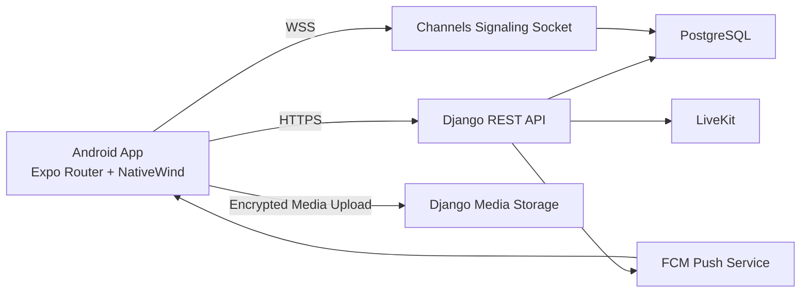
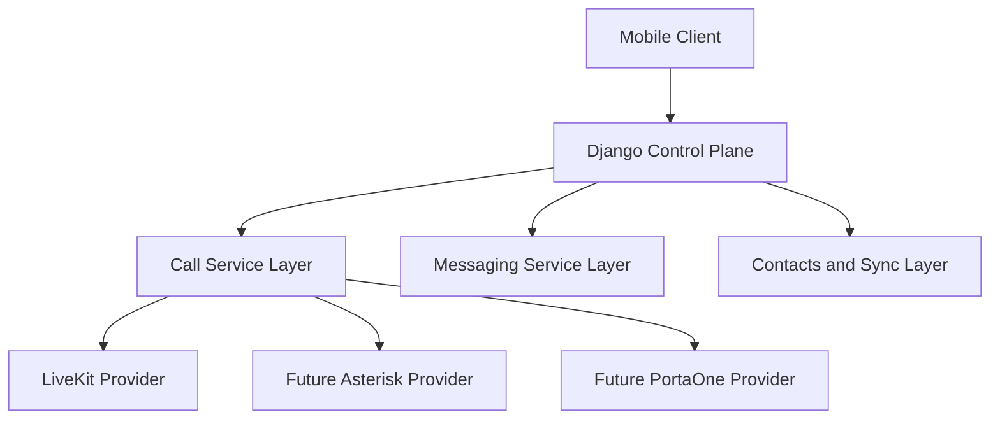
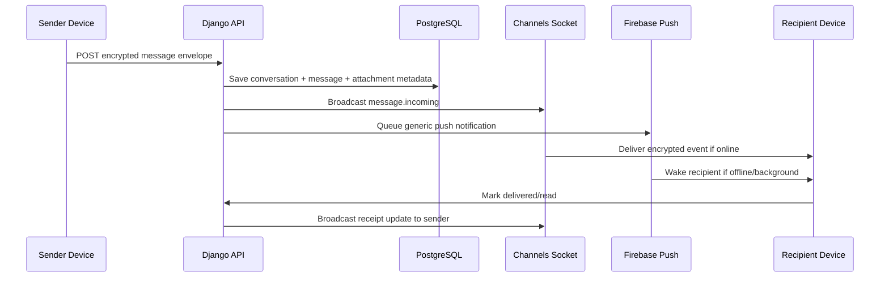
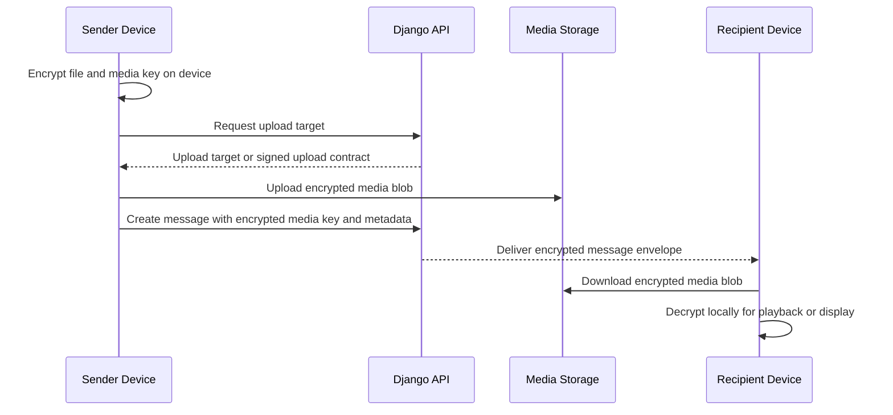

# Communication App Replan

Status: Draft for review

Purpose:

- Re-plan the current Android softphone into a WhatsApp-style communication app.
- Preserve the existing backend call-provider abstraction so future PortaOne and Asterisk integration remains possible.
- Convert the approved product requirements into a concrete execution plan that fits the repository's current implemented state.

Relationship to existing plan:

- `docs/ANDROID_SOFTPHONE_IMPLEMENTATION_PLAN.md` remains the foundational softphone architecture and backend/provider strategy document.
- This document is the active addendum for the new communication-first product direction.
- If this document conflicts with the earlier MVP plan, this document wins for messaging, contacts UX, tab layout, and app-shell behavior.

## 1. Confirmed Product Decisions

The following ambiguous points were clarified before this replan was saved:

- End-to-end encryption is required in the first messaging release for text, image, video, and voice messages.
- Unsaved app users are allowed to reach each other through both messages and calls.
- Phone-contact discovery should upload normalized phone numbers to the backend for matching.
- Avatar taps in the top app bar should open a compact menu with Profile and Settings.

These decisions are now treated as implementation requirements, not open questions.

## 2. Current Baseline

The app is not greenfield anymore. The repo already includes:

- Mobile auth with durable device sessions and silent refresh.
- Bottom-tab navigation via Expo Router.
- Backend user, contacts, devices, and calls models.
- Websocket signaling through Django Channels.
- Firebase push delivery.
- LiveKit calling flows and native Android incoming-call handling.

The major missing product area is messaging. The current contacts and calls surfaces also need to be redesigned to match the new communication-first layout and behaviors.

## 3. New Target Experience

Only three tabs should appear in the bottom navigation:

1. Messages
2. Calls
3. Contacts

All other destinations should move behind hidden routes or the avatar menu.

### 3.1 Messages tab

- Top app bar title: `Messages`
- Top-right action: small avatar that opens a compact menu with Profile and Settings.
- Below the top bar: a search bar for filtering conversations by contact name.
- Main body: conversation list similar to WhatsApp.
- Bottom-right floating action button: start a new conversation.
- Conversation thread must support:
  - text messages
  - image messages
  - video messages
  - voice messages
- Push notifications must behave like a modern messaging app while keeping encrypted content private.

### 3.2 Calls tab

- Top app bar title: `Calls`
- Top-right action: avatar menu
- Below the top bar: a search bar for filtering call history
- Main body: searchable call history list
- Bottom-right floating action button: start a new call from contacts

### 3.3 Contacts tab

- Top app bar title: `Contacts`
- Top-right action: avatar menu
- Main body: matched app users from saved phone contacts plus app-managed contacts
- Bottom-right floating action button: create a new contact
- New-contact flow must:
  - validate whether the number belongs to an app user
  - allow naming and saving the contact
  - allow choosing whether to also sync the saved contact into the phone address book
- Contact detail must support:
  - view details
  - send message
  - start audio call
  - start video call
  - block
  - unblock

### 3.4 Unknown sender behavior

- If user A has saved user B but user B has not saved user A, B must still be able to receive the incoming call or message.
- In the conversation thread and relevant call-entry surfaces, B must see actions to save the contact or block the contact.
- If blocked, future message delivery, future call initiation, and related notifications must be suppressed at the backend rule layer.

## 4. Architecture Delta From Current System

The current system already has the right foundations for auth, realtime delivery, device registration, call signaling, and push delivery. The plan is to add a messaging domain and extend the current app shell rather than replace the existing architecture.

### 4.1 High-level target system



### 4.2 Future provider boundary



Why this remains correct:

- Mobile stays provider-agnostic for telephony.
- Messaging is not tied to any telephony provider.
- Calls and messaging can share contacts, push, auth, and realtime transport.

## 5. Messaging Architecture

### 5.1 Recommendation

Because first release requires encrypted text, image, video, and voice plus offline delivery, this plan recommends a Signal-style 1:1 protocol boundary rather than a custom static ECDH scheme.

Required properties:

- private keys never leave the device
- backend stores only public key bundles and encrypted payloads
- each sent message can be delivered while the recipient is offline
- message content previews are not leaked to push notifications
- encrypted media keys are stored alongside message envelopes, not in plaintext

### 5.2 Backend data model additions

Create a new Django app: `backend/apps/messaging/`

Core models:

- `Conversation`
- `ConversationParticipantState`
- `Message`
- `MessageAttachment`
- `MessageReceipt`
- `UserIdentityKey`
- `SignedPreKey`
- `OneTimePreKey`

Suggested shape:

```python
from apps.common.models import UUIDTimeStampedModel
from django.conf import settings
from django.db import models


class Conversation(UUIDTimeStampedModel):
    participant_low = models.ForeignKey(
        settings.AUTH_USER_MODEL,
        on_delete=models.CASCADE,
        related_name="conversations_low",
    )
    participant_high = models.ForeignKey(
        settings.AUTH_USER_MODEL,
        on_delete=models.CASCADE,
        related_name="conversations_high",
    )
    last_message_at = models.DateTimeField(null=True, blank=True)


class Message(UUIDTimeStampedModel):
    conversation = models.ForeignKey(
        Conversation,
        on_delete=models.CASCADE,
        related_name="messages",
    )
    sender = models.ForeignKey(
        settings.AUTH_USER_MODEL,
        on_delete=models.CASCADE,
        related_name="sent_messages",
    )
    content_type = models.CharField(max_length=20)
    encrypted_payload = models.JSONField()
    client_message_id = models.CharField(max_length=128, unique=True)
    sent_at = models.DateTimeField()
```

Notes:

- `encrypted_payload` must contain ciphertext metadata only.
- Media payloads must be encrypted before upload.
- Receipt state should be per-recipient, not a single flat field on the message.

### 5.3 Message delivery flow



### 5.4 Media message flow



### 5.5 Realtime events

Extend the current socket namespace rather than creating a second websocket channel.

Required event families:

- `message.incoming`
- `message.updated`
- `message.receipt`
- `conversation.updated`
- `typing.started`
- `typing.stopped`
- `contact.updated`

Recommended event payload style:

```typescript
type MessageIncomingEvent = {
  type: "message.incoming";
  payload: {
    conversation_id: string;
    message_id: string;
    sender_id: string;
    content_type: "text" | "image" | "video" | "voice";
    encrypted_payload: Record<string, unknown>;
    created_at: string;
  };
};
```

### 5.6 Push behavior

Use the existing device and Firebase push pipeline.

Rules:

- Never send plaintext message bodies in push payloads.
- Use generic body previews such as `New message`, `Photo`, `Video`, `Voice message`.
- Include conversation and sender IDs so the mobile app can route correctly after resume.

## 6. Contacts and Relationship Rules

The existing contact model already includes `accepted`, `pending`, `rejected`, and `blocked`. That is a useful base, but it is not enough for the new product behavior.

Required additions:

- contact source metadata: phone-sync, app-only, imported, unknown-sender
- local alias or display snapshot for presentation stability
- block and unblock mutation endpoints
- unknown sender state surfaced to the mobile client
- save-contact suggestion state
- matched-number sync endpoint

Recommended relationship rule matrix:

| State              | Incoming message | Incoming call | Reply allowed | Notifications | Visible save action |
| ------------------ | ---------------- | ------------- | ------------- | ------------- | ------------------- |
| Saved              | Yes              | Yes           | Yes           | Yes           | No                  |
| Unknown            | Yes              | Yes           | Yes           | Yes           | Yes                 |
| Blocked            | No               | No            | No            | No            | No                  |
| Pending local save | Yes              | Yes           | Yes           | Yes           | Yes                 |

## 7. Calls Surface Rework

The existing call stack is already implemented for initiation and active-call handling. The missing piece is a real calls-list product surface.

Required backend additions:

- call history list endpoint
- call history search by counterpart name or number
- summary serializer for tab list items

Required mobile additions:

- visible Calls tab
- searchable call history
- FAB to start a new call
- quick actions from history rows
- save or block action when the counterpart is still unknown

## 8. Mobile App-Shell Rework

### 8.1 Navigation changes

- Remove visible bottom tabs for Home, Search, and Profile.
- Keep only `Messages`, `Calls`, and `Contacts` in the tab bar.
- Move `Profile` and `Settings` behind avatar menu routes.
- Keep call-active routes hidden and directly navigable.

Suggested Expo Router tab shape:

```tsx
<Tabs>
  <Tabs.Screen name="index" options={{ title: "Messages" }} />
  <Tabs.Screen name="calls-list" options={{ title: "Calls" }} />
  <Tabs.Screen name="contacts" options={{ title: "Contacts" }} />
  <Tabs.Screen name="profile" options={{ href: null }} />
  <Tabs.Screen name="settings" options={{ href: null }} />
  <Tabs.Screen name="calls" options={{ href: null, headerShown: false }} />
</Tabs>
```

### 8.2 Loading behavior

The current root layout returns `null` while fonts and auth hydrate. Replace that with a centered spinner screen so the user sees a deliberate loading state after splash.

### 8.3 Styling migration

Requirement: migrate the app design from `StyleSheet` usage to NativeWind while keeping the current dark theme direction.

Execution rule:

- Do not attempt a single-shot rewrite of all screens.
- First create shared NativeWind primitives for surfaces, cards, top bars, list rows, FABs, search bars, and action buttons.
- Then migrate screens slice-by-slice.

Recommended migration order:

1. Root loading and auth screens
2. App shell and top bars
3. Messages surfaces
4. Calls surfaces
5. Contacts surfaces
6. Profile and Settings
7. Shared secondary components

## 9. Feature-by-Feature Implementation Plan

### Phase A: Documentation and contract freeze

Deliverables:

- save this replan document
- add a proposed feature list document
- update the implementation tracker and remaining tracker to point at this replan
- add a reference pointer from the original softphone plan

Exit criteria:

- docs are reviewable in repo
- implementation work can start without reopening product-level ambiguity

### Phase B: Backend messaging foundation

Deliverables:

- `apps.messaging` Django app
- migrations for messaging and key-bundle models
- conversation list endpoint
- thread messages endpoint
- message send endpoint
- receipt update endpoint
- upload contract endpoint

Exit criteria:

- encrypted text messages can be sent and stored
- backend stores ciphertext and public key data only
- basic conversation list loads for the authenticated user

### Phase C: Mobile messaging MVP

Deliverables:

- Messages tab
- conversation search
- new-conversation picker
- thread view
- encrypted text sending and receiving
- receipt updates
- push deep-link routing

Exit criteria:

- two devices can exchange encrypted text messages
- background and foreground delivery both work

### Phase D: Media and voice messages

Deliverables:

- image and video attachments
- encrypted upload flow
- voice recording and playback
- generic encrypted-media push notifications

Exit criteria:

- two devices can exchange encrypted image, video, and voice messages

### Phase E: Calls tab and history

Deliverables:

- Calls tab list screen
- search over call history
- new-call contact picker
- unknown-contact save or block affordances

Exit criteria:

- users can search and re-initiate calls from history

### Phase F: Contacts redesign and sync

Deliverables:

- phone-contact permission and sync
- number normalization and backend matching
- contact add flow with app-user validation
- optional sync-to-phone-contact toggle
- block and unblock controls

Exit criteria:

- matched app users appear from phone contacts
- save or block flows work for unknown inbound contacts

### Phase G: NativeWind completion and regression pass

Deliverables:

- replace major screen-level StyleSheet layouts with NativeWind primitives
- verify dark visual language remains stable
- keep only minimal StyleSheet use for edge cases if strictly necessary

Exit criteria:

- main user-facing surfaces no longer depend on StyleSheet-heavy screen implementations

## 10. File Plan

### Backend files to create

- `backend/apps/messaging/__init__.py`
- `backend/apps/messaging/apps.py`
- `backend/apps/messaging/models.py`
- `backend/apps/messaging/serializers.py`
- `backend/apps/messaging/views.py`
- `backend/apps/messaging/services.py`
- `backend/apps/messaging/tasks.py`
- `backend/apps/messaging/urls.py`
- `backend/apps/messaging/tests.py`

### Backend files to update

- `backend/config/settings/base.py`
- `backend/config/urls.py`
- `backend/apps/calls/consumers.py`
- `backend/apps/calls/realtime.py`
- `backend/apps/calls/views.py`
- `backend/apps/calls/urls.py`
- `backend/apps/contacts/models.py`
- `backend/apps/contacts/views.py`
- `backend/apps/devices/services.py`

### Mobile files to create or repurpose

- `mobile/app/(app)/index.tsx` as Messages
- `mobile/app/(app)/calls-list.tsx`
- `mobile/app/(app)/contacts.tsx` redesign
- `mobile/app/(app)/messages/[conversationId].tsx`
- `mobile/app/(app)/messages/new.tsx`
- `mobile/src/features/messaging/api.ts`
- `mobile/src/features/messaging/types.ts`
- `mobile/src/features/messaging/hooks.ts`
- `mobile/src/features/messaging/crypto.ts`
- `mobile/src/features/messaging/components/*`
- `mobile/src/stores/message-store.ts`

### Mobile files to update

- `mobile/app/_layout.tsx`
- `mobile/app/(app)/_layout.tsx`
- `mobile/app/(auth)/login.tsx`
- `mobile/src/providers/app-providers.tsx`
- `mobile/src/lib/realtime/socket-client.ts`

## 11. Testing Strategy

### Automated backend tests

- messaging model rules
- encrypted envelope validation
- send message API
- conversation list ordering
- receipt updates
- media attachment flows
- call history list and search
- contact match endpoint
- block and unblock enforcement

### Mobile structural checks

- `npx tsc --noEmit`
- `npx expo export --platform android`
- `npx expo prebuild --platform android --no-install`

### Manual two-device checks

- text messaging
- image messaging
- video messaging
- voice messaging
- save unknown sender
- block unknown sender
- unblock contact
- contact sync from phone book
- initiate call from Messages
- initiate call from Calls
- initiate call from Contacts
- foreground delivery
- background delivery
- terminated-state delivery

## 12. Non-goals For This Replan

The following are deliberately not included in the first execution wave:

- group chats
- disappearing messages
- reactions and edits
- stories or status system
- desktop or web clients
- actual PortaOne integration
- actual Asterisk SIP integration

## 13. Review Outcome Expected Before Coding Starts

Reviewers should confirm:

- the three-tab product direction
- the E2E encryption baseline
- the unknown-sender rules
- the phone-contact sync and matching policy
- the NativeWind migration order
- the phased implementation order

Once this review passes, implementation should continue in Agent mode with the tracker files updated after each completed slice.