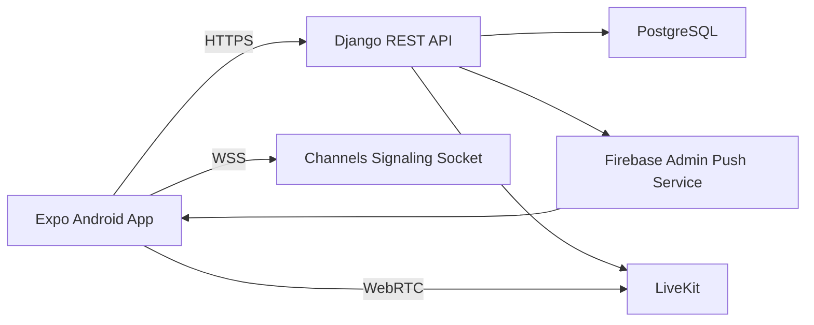
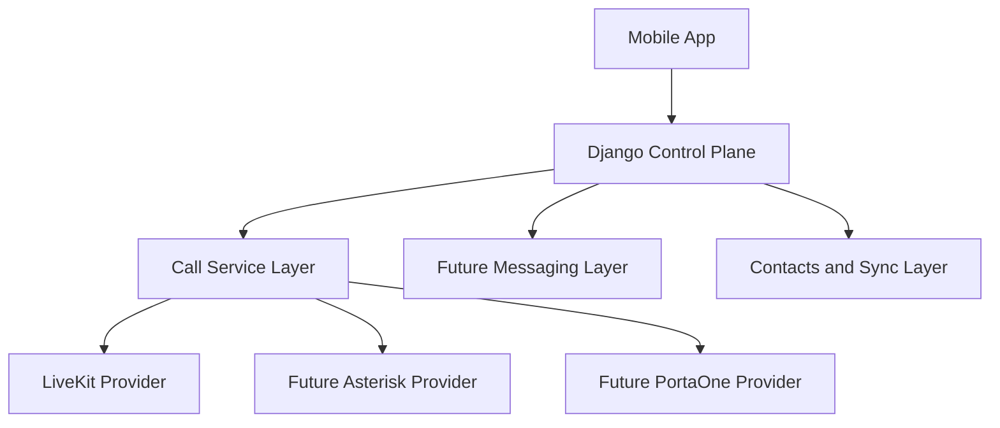

# Communication App Replan

Status: Active implementation plan; Gate 0 documentation reconciled

Purpose:

- Re-plan the current Android softphone into a communication-first Android app.
- Preserve the existing backend call-provider abstraction so future PortaOne, Asterisk, SIP, and PSTN integration remain possible.
- Reconcile prior planning documents with the real repository state before the next implementation wave starts.

Relationship to existing plan:

- `docs/ANDROID_SOFTPHONE_IMPLEMENTATION_PLAN.md` remains the original softphone architecture reference.
- This document is now the active communication-product planning document.
- If this document conflicts with earlier planning on messaging, lifecycle, navigation, push behavior, or contact policy, this document wins.

## 1. Executive Summary

The repository already contains substantial backend and mobile calling foundations. Backend auth, device sessions, contacts, devices, call lifecycle APIs, Channels websocket signaling, Firebase Admin push delivery, and LiveKit token generation exist in code. Mobile already includes Expo Router navigation, SecureStore-backed auth persistence, authenticated API retry with refresh, websocket signaling, push registration, LiveKit audio and video call screens, CallKeep, Notifee, and background incoming-call handling.

The major missing product area is messaging. End-to-end encryption, encrypted attachments, message-safe push payloads, unknown-user policy, phone-contact sync, and the approved three-tab product shell are not implemented. The current visible mobile shell is still `Home`, `Contacts`, `Search`, and `Profile`, not `Messages`, `Calls`, and `Contacts`.

Two lifecycle issues still need validation before safe feature expansion. First, the reported reopen-logs-out bug is not proven from repository evidence. The original audit found that websocket disconnects could rotate device-session tokens; that trigger has now been removed, but physical-device reproduction is still required. Second, the reported screen-timeout bug is not yet proven in source. No explicit keep-awake flags or keep-awake library usage were found in the mobile source tree, so the issue must be treated as an investigation item tied to native call or media behavior rather than assumed application-wide code.

The first implementation phase must therefore be architecture reconciliation plus authentication and lifecycle hardening. Messaging and E2EE should not begin until auth persistence, logout semantics, push and device linkage, and Android lifecycle reliability are stable and documented.

## 2. Repository Audit Findings

### Backend

- The backend is a Django 6 codebase with a custom UUID-based user model under `backend/apps/accounts/`.
- `DeviceSession` exists and is used as the durable mobile session credential.
- JWT access tokens are issued through SimpleJWT and are separate from the device-session token.
- Devices are stored separately from device sessions under `backend/apps/devices/`.
- Calls are modeled and managed under `backend/apps/calls/` with provider support already represented by `Call.provider`.
- Websocket signaling uses Django Channels with JWT-authenticated socket connections.
- Firebase Admin push sending is implemented for registered devices.
- Existing automated tests cover auth basics, devices basics, and call lifecycle basics.

### Mobile

- The mobile app uses Expo Router under `mobile/app/`.
- Auth persistence uses Zustand plus `expo-secure-store`.
- Authenticated requests use a retry-on-401 refresh path.
- Push registration uses Expo Notifications plus React Native Firebase Messaging.
- Background call actions already reuse the persisted device session.
- Realtime calling and presence are handled through a singleton websocket provider.
- LiveKit audio and video call screens already exist and are tied into call APIs.

### Current Product State

- Messaging does not exist in backend or mobile.
- Phone-contact sync does not exist.
- Unknown-user messaging and calling do not exist.
- Block and unblock policy is not implemented end to end.
- The approved three-tab shell does not exist yet.

## 3. Documentation vs Code Discrepancies

- Earlier planning documents describe durable device sessions and silent refresh as already solved. Code mostly supports that claim, but there is no dedicated startup bootstrap flow that validates or refreshes auth before opening the private app shell.
- Earlier planning implies the communication-product shell is largely aligned. The real mobile shell is not aligned with the approved `Messages`, `Calls`, `Contacts` experience.
- Earlier tracking documents overstate project completeness for the new communication-app scope. Messaging, E2EE, contact sync, unknown-user policy, block enforcement, and lifecycle hardening remain unimplemented.
- Earlier docs do not capture the current logout and device-registration gap, the likely duplicate incoming-call notification risk, or the need to distinguish Android background, swipe-away, process death, force-stop, and reboot states explicitly.

## 4. Current Architecture

### 4.1 Existing system shape


```mermaid
flowchart LR
  M[Expo Android App] -->|HTTPS| API[Django REST API]
  M -->|WSS| WS[Channels Signaling Socket]
  API --> DB[PostgreSQL]
  API --> FCM[Firebase Admin Push Service]
  API --> LK[LiveKit]
  FCM --> M
  M -->|WebRTC| LK
```

### 4.2 Provider boundary


```mermaid
flowchart TD
  APP[Mobile App] --> CONTROL[Django Control Plane]
  CONTROL --> CALLS[Call Service Layer]
  CALLS --> LK[LiveKit Provider]
  CALLS --> AST[Future Asterisk Provider]
  CALLS --> P1[Future PortaOne Provider]
  CONTROL --> MSG[Future Messaging Layer]
  CONTROL --> CONTACTS[Contacts and Sync Layer]
```

### 4.3 Existing implementation anchors

- Auth and device sessions: `backend/apps/accounts/`
- Devices and push registration: `backend/apps/devices/`
- Calls, signaling, and LiveKit token generation: `backend/apps/calls/`
- Mobile auth store: `mobile/src/stores/auth-store.ts`
- Mobile API refresh path: `mobile/src/lib/api/client.ts`
- Mobile realtime and native incoming-call behavior: `mobile/src/providers/realtime-provider.tsx` and `mobile/src/lib/calls/native-call-ui.ts`

## 5. Existing Features That Must Be Preserved

- Custom user model and phone-based authentication
- Device-session-backed mobile authentication
- Backend `register`, `login`, `refresh`, `logout`, and `me` endpoints
- Device register, list, and delete endpoints
- Firebase Admin push delivery service
- Call provider abstraction and LiveKit join-media flow
- Channels websocket signaling and presence fanout
- Mobile SecureStore persistence
- Mobile CallKeep and Notifee incoming-call handling
- Mobile LiveKit audio and video calling
- Future provider compatibility for PortaOne, Asterisk, SIP, and PSTN

## 6. New Product Requirements

- Replace the visible app shell with `Messages`, `Calls`, and `Contacts`.
- Add 1:1 text, image, video, and voice messaging.
- Ship first-release E2EE for all message types.
- Support unknown users messaging and calling each other unless blocked.
- Add save-contact and block actions for unknown senders and callers.
- Add phone-contact synchronization and backend matching.
- Preserve existing calling flows and integrate them into the new shell.
- Ensure persistent login behavior feels like a modern messaging app.
- Support incoming notifications for supported foreground, background, and terminated states.
- Respect Android screen timeout outside of properly scoped call-only wake behavior.

## 7. Authentication Lifecycle Findings

### Current behavior from code

- `DeviceSession` stores a hashed token, timestamps, label, and revocation fields.
- There is no explicit expiry on `DeviceSession`.
- Login creates a new device session and returns a JWT access token plus raw device-session token.
- Refresh validates the stored device-session token and rotates it by default.
- Logout revokes only the provided device session.
- Mobile stores `access_token`, `device_session_token`, and user summary in SecureStore.
- Mobile route guards wait for auth-store hydration before redirecting.
- Mobile protected API calls silently refresh after a `401`.
- Startup now validates the hydrated session through the current-user endpoint; expired access tokens use the same `401` refresh path.
- Generic websocket disconnects no longer rotate device-session tokens. Foreground reconnect still reuses the most recently persisted access token.
- A transient refresh/network failure no longer clears the persisted device session; invalid/revoked sessions still clear it on `401`.

### Meaning for target behavior

- Durable login is architecturally intended.
- Startup validation now runs through a dedicated bootstrap flow; physical restart and revoked-session states remain unvalidated.
- Expired access tokens can recover, but only when a refresh-triggering path runs.
- Revoked device sessions clear local state correctly once refresh is attempted.

## 8. Device Session / Silent Refresh Bug Analysis

### Observed behavior

- Reported production-like behavior: a user closes the app and reopens it, then appears logged out.

### Current implementation

- SecureStore hydration runs in the root layout.
- Private route access depends on whether the hydrated store still contains a session.
- Protected API requests attempt refresh on `401`.
- Generic websocket disconnects no longer refresh or clear auth; foreground reconnect uses the current persisted access token.

### Expected behavior

```text
App launch
  -> loading state
  -> hydrate persisted device session
  -> validate or refresh access token
  -> fetch current user
  -> initialize realtime and push state
  -> open private routes
```

### Root-cause hypothesis

The original code-based hypothesis was that websocket disconnects could trigger refresh and token rotation during ordinary backgrounding, shutdown, or network churn. That refresh trigger has been removed. The reported symptom is still unverified, so the hypothesis must not be treated as a proven root cause.

### Evidence required

- Reproduce on physical Android hardware for normal close, swipe-away, process kill, access-token expiry, and device reboot.
- Instrument mobile logs for hydration, refresh attempts, token updates, websocket status transitions, and `clearSession` calls.
- Inspect backend `DeviceSession.rotated_at` behavior during reproduction.

### Proposed fix

- Add a dedicated mobile auth bootstrap coordinator.
- Stop rotating device-session tokens on generic websocket disconnects.
- Refresh only on startup bootstrap and explicit `401` recovery paths.
- Persist refreshed credentials before reconnecting realtime.

### Implementation status

- Startup bootstrap now validates the current user before mounting the private app tree and exposes a retry state for transient failures.
- API refresh is single-flight, persists rotated credentials before the retried request, and clears local auth only when the refresh endpoint reports an unauthorized session.
- Generic websocket disconnects update connection state without triggering refresh or logout.
- Mobile login and push registration now share the same persisted installation identity.
- Device sessions now persist installation identity, and server-side logout invalidates active device registrations that belong to the same installation.
- Settings sign-out now validates the session, deactivates the current push registration when its device row can be identified, then revokes the device session.
- Physical-device reproduction, regression coverage, and the device-session-to-installation linkage decision remain open.

### Regression tests

- Startup restore with valid session
- Startup restore with expired access token and valid device session
- Startup restore with revoked device session
- Explicit logout
- Socket disconnect without forced logout
- Token rotation persistence after refresh

### Manual verification

- Login, close, reopen
- Login, let access token expire, reopen
- Login, swipe from recents, reopen
- Login, kill process, reopen
- Login, revoke server-side device session, reopen
- Login, logout, reopen

## 9. Android Screen Timeout Bug Analysis

### Audit result so far

- No explicit `FLAG_KEEP_SCREEN_ON`, `android:keepScreenOn`, wake-lock code, `expo-keep-awake` usage, or `react-native-keep-awake` usage was found in the mobile source or generated Android app source.
- The repository currently does not prove an app-wide keep-awake bug.

### Investigation focus

- LiveKit audio and video runtime behavior
- CallKeep and Notifee full-screen incoming-call behavior
- Generated Android activity and window flags after prebuild
- Call-only native behavior during active audio and video calls

### Desired lifecycle behavior

- Normal browsing: system timeout applies normally.
- Messages: system timeout applies normally.
- Contacts: system timeout applies normally.
- Calls: any keep-awake behavior, if required, must be scoped to the active call state only and released immediately afterward.

### Evidence required

- Physical Android testing during idle browsing, ringing call, connected audio call, connected video call, and post-call idle state.
- `adb dumpsys` validation during those states.

## 10. FCM Lifecycle and Notification Analysis

### Current implementation

- Backend stores devices separately from device sessions.
- Mobile push registration runs only after authentication and permission grant.
- Current push channel setup is call-oriented.
- Background FCM handling currently parses call intents only.
- Incoming-call pushes now use a high-priority data-only payload so the mobile app can render native incoming-call UI without a duplicate system notification body.

### Current gaps

- No message-notification architecture exists.
- Device rows now persist installation identity and can link to the active device session during registration, but hardware validation and token-replacement behavior remain open.
- Logout invalidates the current-device push registration through server-side device invalidation, but hardware validation remains open.
- The same physical push token can remain active under more than one account unless separately invalidated.

### Duplicate-handler risk

Incoming-call pushes no longer send visible backend notification text or body for call alerts; the mobile client is responsible for rendering the native incoming-call surface. Hardware validation is still required across supported Android states.

### Android state distinctions that must be documented

- App backgrounded
- App swiped from recents
- Process killed by Android
- Force-stopped from Settings
- Device rebooted
- Battery optimization restrictions
- OEM background restrictions
- Notification permission denied
- FCM token rotated
- App data cleared
- User logged out

### Supported-behavior rule

The final implementation plan must document what Android and FCM reliably support and what they do not. Force-stop behavior and some OEM restrictions must be documented as platform limitations, not promised away.

## 11. Incoming Call Lifecycle

The existing stack already includes meaningful incoming-call support:

- Backend call creation and push dispatch
- FCM background handling in mobile app startup code
- Notifee incoming-call notification actions
- CallKeep incoming-call UI
- Persisted-session-backed background accept and reject behavior
- Initial-notification and initial-call-intent routing on app open

This architecture should be preserved. The next work is to verify lifecycle reliability, remove duplication risk, and ensure the auth lifecycle changes do not regress terminated incoming-call behavior.

## 12. E2EE Architecture Gate

Messaging must not be implemented as a plaintext server-side message relay and then retrofitted later. E2EE is a hard architecture gate.

### Required decisions

- Device identity and user identity model
- Per-device public and private key lifecycle
- Multi-device support for one account
- Reinstall and compromised-device behavior
- Logout and device revocation behavior
- Encrypted media strategy
- Safe push payload strategy
- Protocol and library selection

### Gate requirement

Before full messaging implementation starts, prove the following on working code:

```text
device A encrypts
-> server stores ciphertext only
-> device B decrypts
```

No custom cryptographic protocol should be invented.

## 13. Messaging Architecture

### Backend

Create `backend/apps/messaging/` with models for:

- `Conversation`
- `ConversationParticipantState`
- `Message`
- `MessageAttachment`
- `MessageReceipt`
- `UserIdentityKey`
- `SignedPreKey`
- `OneTimePreKey`

### Delivery rules

- REST remains the primary write and fetch path.
- Existing websocket infrastructure should be extended with message event families.
- Push should wake offline recipients without exposing forbidden plaintext.
- Idempotency, pagination, ordering, retries, and read receipts must be first-class design elements.

### Realtime event families

- `message.incoming`
- `message.updated`
- `message.receipt`
- `conversation.updated`
- `typing.started`
- `typing.stopped`

## 14. Contact Synchronization Architecture

### Requirements

- Request Android contacts permission deliberately.
- Normalize numbers locally before backend matching.
- Handle duplicates and country-code differences.
- Return matched app users only.
- Define privacy boundaries before upload strategy is chosen.

### Required policy work

- Decide whether raw normalized numbers, hashes, or a hybrid strategy are sent and retained.
- Define re-sync, removal, and block interaction behavior.
- Avoid unrestricted phonebook upload without retention and privacy rules.

## 15. Calling Architecture Compatibility

The calling stack must not regress while messaging is added.

Protected capabilities:

- Messages to call
- Calls tab to call
- Contacts to call
- Incoming call
- Outgoing call
- Audio call
- Video call
- Background call
- Terminated incoming call

Compatibility rule:

- The mobile client must stay provider-agnostic.
- The backend must continue deciding call provider and media authorization.

## 16. Mobile Call Screen Redesign Plan

The current mobile call screens are functionally correct but visually read as diagnostic application pages rather than polished communication surfaces. The active audio and video routes expose raw call-state and media-session details, the incoming and outgoing routes rely on large blocks of explanatory copy, and the call stack still renders standard screen headers. This is sufficient for call plumbing validation, but it is not sufficient for the communication-first product direction.

### UX target

- Redesign the in-app call journey around a WhatsApp-inspired interaction model across four surfaces: incoming answer, outgoing/ringing, active audio, and active video.
- Use immersive full-screen layouts with strong contact identity, concise status copy, and bottom-anchored circular controls.
- Keep the redesign inspired by WhatsApp's hierarchy and pacing without turning it into a near-clone.
- Preserve provider-agnostic behavior and existing backend lifecycle contracts.
- Ship a practical first-pass in-call control set: mute and unmute microphone, toggle loud speaker or earpiece, toggle video camera where available, and place the local media session on hold or resume.

### Architecture approach

- Extract shared active-call orchestration from the current `audio.tsx` and `video.tsx` routes into reusable call-screen state logic.
- Add reusable call UI primitives for contact hero, call shell, bottom control dock, status copy, and video stage.
- Convert the call route stack into headerless full-screen routes so tabs and standard stack chrome do not appear during call flows.
- Keep `LiveKitCallRoom` as the media boundary and only extend it where redesigned controls require real media capability changes.

### NativeWind requirement

- All new call-screen UI design and styling work must be implemented in NativeWind.
- Scope NativeWind adoption for this work to the call surfaces and shared call UI primitives so the redesign does not become a broad app-wide styling rewrite.
- Keep call-state orchestration, routing, realtime, and media-session logic separate from the NativeWind presentation layer.

### Route-specific plan

- Incoming call screen: emphasize caller identity and answer/reject actions with minimal explanatory text.
- Outgoing/ringing screen: show a cleaner waiting surface with live state transitions and cancel action.
- Active audio screen: show large contact identity, state or duration, and a concise control dock for mute, speaker, and end.
- Active video screen: show full-screen remote video, pinned local preview, top status overlay, and bottom control dock for mute, camera, and end.

### Constraints

- The current mobile data model does not expose avatar images, so the first redesign pass should use initials and typography rather than photo-based layouts.
- The current implementation does not yet expose richer in-call controls such as camera flip or route picker wiring. These should be treated as follow-up capabilities unless the media SDK supports them cleanly during implementation.
- The current backend and provider contract does not expose a network-level hold action. The first pass should therefore implement hold as a local media pause state and clearly preserve room and call lifecycle continuity until a provider-backed hold contract exists.
- The redesign must not break existing incoming-call routing from websocket, push, CallKeep, or Notifee flows.

### Verification

- Static verification: TypeScript, Expo export, and Expo prebuild.
- Manual Android verification: incoming audio, incoming video, outgoing audio, outgoing video, permission denial and retry, route transitions, and end-call cleanup.
- Regression rule: the redesign must improve presentation without regressing current call lifecycle reliability.

## 17. Navigation / UI Architecture

### Current state

- Visible tabs: `Home`, `Contacts`, `Search`, `Profile`
- Hidden routes: `Settings` and `calls/*`

### Target state

- Visible tabs: `Messages`, `Calls`, `Contacts`
- Avatar menu: `Profile`, `Settings`
- Hidden routes: active call screens and secondary flows

### Loading state

The app should show a deliberate loading state after splash while auth bootstrap and startup initialization complete. Private routes should not rely on immediate post-hydration access alone.

## 18. NativeWind Migration Strategy

- Do not combine a large styling rewrite with auth and lifecycle fixes.
- Exception: the call-screen redesign may use NativeWind immediately as a tightly scoped slice covering only active, incoming, and outgoing call UI plus shared call presentation primitives.
- Migrate after core lifecycle and communication flows are stable.
- Move slice by slice using shared primitives for list rows, cards, top bars, FABs, and search bars.

Recommended order:

1. Loading and auth surfaces
2. Call screens and shared call presentation primitives
3. New three-tab app shell
4. Messages
5. Calls list and details
6. Contacts
7. Profile and Settings

## 19. Backend Implementation Phases

### Gate 0: Repository and Architecture Reconciliation

- Freeze the real current architecture in docs.
- Record lifecycle, auth, screen-timeout, and push findings.

### Gate 1: Authentication Persistence

- Reproduce the logout bug.
- Add startup bootstrap.
- Fix refresh and rotation policy.
- Invalidate current-device push registration on logout.
- Add stronger device and device-session linkage.

### Gate 2: Lifecycle and Notification Reliability

- Define supported Android states.
- Resolve duplicate incoming-call notification handling.
- Add token-replacement behavior.

### Gate 3: E2EE Feasibility

- Prove encrypted device-to-device delivery.

### Gate 4: Backend Messaging Foundation

- Add messaging app, endpoints, events, and receipts.

### Gate 5: Contact Sync and Policy Completion

- Add sync endpoints and block rules.

## 20. Mobile Implementation Phases

### Gate 1 work

- Add auth bootstrap coordinator.
- Add startup loading screen.
- Remove websocket-disconnect-driven token rotation.
- Harden logout behavior.

### Gate 2 work

- Separate message and call notification handling.
- Verify background and terminated lifecycle paths.

### Call screen redesign work

- Extract shared call-screen state and route presentation primitives.
- Rebuild incoming, outgoing, audio, and video call screens around a WhatsApp-inspired full-screen layout.
- Implement all call-screen presentation work in NativeWind.
- Add shared in-call controls for mute, speaker routing, local hold and resume, and camera toggle where applicable.
- Preserve existing call lifecycle, join-media, CallKeep, Notifee, and realtime route behavior.
- Initial implementation has headerless NativeWind call surfaces, shared presentation primitives, and shared active-call orchestration; physical lifecycle and media verification remain to be completed.

### Gate 5 work

- Add `Messages` feature area under `mobile/src/features/messaging/`.
- Use TanStack Query for message and conversation server state.
- Convert the visible shell to `Messages`, `Calls`, and `Contacts`.

## 21. Native Android Implementation Phases

- Validate generated Android config after auth and push changes.
- Investigate screen-timeout behavior with hardware and system diagnostics.
- Scope any wake behavior to active call state only.
- Preserve CallKeep, Notifee, and LiveKit integration while adjusting lifecycle behavior.

## 22. Testing Strategy

### Backend automated tests

- Auth bootstrap semantics
- Device session rotation and revocation
- Logout and device invalidation
- Device token replacement
- Unknown-user and block authorization
- Messaging and encrypted envelope validation
- Push payload generation

### Mobile static checks

- `npx tsc --noEmit`
- `npx expo export --platform android`
- `npx expo prebuild --platform android --no-install`

### Native validation

- Android debug assemble using the established repo workflow

### Physical-device validation

- Required for FCM, terminated-state notifications, CallKeep, Notifee, ringtone, vibration, screen wake, contacts permission, LiveKit media, and screen timeout

## 23. Physical Device Test Matrix

### Authentication

- login -> close -> reopen
- login -> access token expiry -> reopen
- login -> swipe away -> reopen
- login -> process kill -> reopen
- login -> device reboot -> reopen
- login -> revoke session -> reopen
- login -> logout -> reopen

### Calls

- outgoing audio and video
- incoming accept, reject, cancel, end
- busy and timeout
- background incoming call
- terminated incoming call

### Notifications

- foreground call push
- background call push
- foreground message push
- background message push
- terminated message push where platform allows
- denied notification permission
- FCM token rotation

### Screen behavior

- idle browsing
- idle contacts
- idle future messaging screen
- ringing incoming call
- connected audio call
- connected video call
- post-call idle

## 24. Security Considerations

- Do not treat push tokens as the only stable device identity.
- Link logout semantics to current installation reachability.
- Prevent old device registrations from remaining active after account switches.
- Do not leak plaintext messages in push payloads when E2EE forbids it.
- Use audited cryptographic libraries and documented key lifecycle rules.
- Enforce block policy consistently across REST, websocket, push, and media-join authorization.

## 25. Performance Considerations

- Avoid refresh loops triggered by reconnect churn.
- Keep message and conversation server state in TanStack Query.
- Use pagination for call history and message history.
- Use minimal push payloads when native rendering already generates richer UI.

## 26. Failure and Recovery Scenarios

- Expired access token with valid device session should recover silently during bootstrap.
- Revoked device session should clear local auth and return the user to auth routes.
- Explicit logout should revoke backend session and stop further push reachability for that installation.
- Token rotation failures should not silently strand the client in an unrecoverable state.
- Unsupported Android states must be documented rather than hidden.

## 27. Regression Matrix

| Area           | Existing behavior                             | New behavior                                                                                 | Must not regress |
| -------------- | --------------------------------------------- | -------------------------------------------------------------------------------------------- | ---------------- |
| Login          | Secure session exists                         | Startup bootstrap and hidden auth transitions                                                | Yes              |
| Logout         | Revokes device session only                   | Revoke current session and current-device push reachability                                  | Yes              |
| Device session | Persisted in SecureStore                      | Survives restart with deterministic refresh policy                                           | Yes              |
| Token refresh  | Retry on 401                                  | Add startup refresh and remove disconnect-driven rotation                                    | Yes              |
| Messages       | Not implemented                               | E2EE 1:1 messaging                                                                           | N/A              |
| Calls          | LiveKit audio and video calling               | Integrated into new shell                                                                    | Yes              |
| Contacts       | Manual accepted contacts                      | Add sync and unknown-user policy                                                             | Yes              |
| FCM            | Call push only                                | Call plus message notification architecture                                                  | Yes              |
| CallKeep       | Incoming native call UI                       | Preserve terminated incoming-call behavior                                                   | Yes              |
| Notifee        | Incoming-call notifications and actions       | Preserve call actions and add safe message channels                                          | Yes              |
| Screen timeout | Bug reported                                  | Respect system timeout outside call-only scope                                               | Fix              |
| LiveKit        | Working provider                              | Preserve with messaging integration                                                          | Yes              |
| Expo Router    | Working signed-in shell                       | Convert to Messages, Calls, Contacts                                                         | Yes              |
| Call UI        | Functional but diagnostic in-app call screens | WhatsApp-inspired NativeWind call surfaces across incoming, outgoing, audio, and video flows | Yes              |

## 28. Documentation/Tracker Updates

This re-plan requires the tracker files to reflect the real current state:

- `docs/PROPOSED_FEATURE_LIST.md` must distinguish existing foundations from missing product work.
- `docs/IMPLEMENTATION_SO_FAR.md` must remain factual and stop implying the communication scope is mostly complete.
- `docs/REMAINING_IMPLEMENTATION.md` must be realigned to the architecture gates in this document.

Add a dedicated section for newly identified lifecycle and reliability requirements covering:

- persistent login and startup refresh
- screen-timeout investigation
- terminated-state message notification
- terminated-state call notification reliability
- sound, ringtone, and vibration behavior
- Android lifecycle limitations
- FCM token and registration reliability
- NativeWind-only call-screen redesign requirements

## 29. Risks and Mitigations

- Risk: the logout bug remains non-reproducible during desk review.
  - Mitigation: gate the first implementation phase around instrumentation and reproduction, not blind rewrites.
- Risk: auth changes break incoming-call behavior.
  - Mitigation: preserve background-call-actions path and test on hardware immediately after auth changes.
- Risk: notification dedup changes break terminated incoming calls.
  - Mitigation: validate across supported Android states before messaging work begins.
- Risk: E2EE design blocks messaging delivery.
  - Mitigation: make E2EE a hard feasibility gate before full messaging implementation.
- Risk: UI migration increases blast radius.
  - Mitigation: defer NativeWind-heavy migration until lifecycle work is stable.
- Risk: the NativeWind call-screen redesign leaks into unrelated mobile surfaces.
  - Mitigation: keep NativeWind adoption for this phase isolated to call routes and shared call presentation primitives.

## 30. Architecture Decisions Required

1. Device identity model
2. DeviceSession to Device linkage model
3. Device-session rotation policy after startup hardening
4. Incoming-call push payload strategy
5. E2EE protocol and library choice
6. Phone-contact sync privacy model
7. Unknown-user calling and messaging authorization details
8. Final in-call control set for the first NativeWind redesign pass

Initial approved first-pass control set:

- Audio call: mute or unmute, loud speaker or earpiece toggle, local hold or resume, end call
- Video call: mute or unmute, camera on or off, loud speaker or earpiece toggle, local hold or resume, end call
- Deferred controls: camera flip, Bluetooth picker UI, keypad, transfer, merge, and provider-backed network hold

## 31. Final Recommended Execution Order

1. Gate 0: repository and documentation reconciliation
2. Gate 1: authentication persistence and device-session hardening
3. Call-screen state extraction and NativeWind redesign
4. Gate 2: Android lifecycle and notification reliability
5. Screen-timeout investigation and scoped fix
6. Gate 3: E2EE feasibility spike
7. Gate 4: backend messaging foundation
8. Gate 5: mobile messaging foundation
9. Encrypted media
10. Calls and messaging integration
11. Contact synchronization and policy completion
12. Broader NativeWind migration
13. Full regression and physical-device validation

## 32. Definition of Done

### Authentication

```text
User logs in
-> Device session persists
-> App closes
-> App reopens
-> Loading state runs
-> Access token validates or refreshes
-> User enters private routes without seeing login
```

Explicit logout must still log the user out. A revoked device session must force re-authentication.

### Screen Timeout

```text
App open normally
-> User does nothing
-> Android system timeout occurs
-> Screen turns off according to system settings
```

### Incoming Message

```text
Sender sends message
-> Recipient app foreground/background/terminated
-> FCM when platform allows
-> Android notification
-> Tap opens correct conversation
```

### Incoming Call

```text
Caller starts call
-> FCM/native call handling
-> Recipient foreground/background/terminated
-> Incoming call UI
-> Supported wake behavior
-> Answer
-> LiveKit call connection
```

### E2EE

```text
Device A encrypts
-> Server stores and relays ciphertext
-> Device B decrypts
```

### Existing Calling

Existing LiveKit audio and video calling plus native incoming-call handling must remain functional.

### Call Screen UX

```text
User enters incoming, outgoing, audio, or video call flow
-> Standard stack chrome stays hidden
-> Full-screen NativeWind call UI appears
-> Primary call controls are immediately reachable
-> Active call transitions remain reliable
```

### Future Telephony

The backend provider abstraction must remain compatible with future PortaOne, Asterisk, SIP, and PSTN work.
